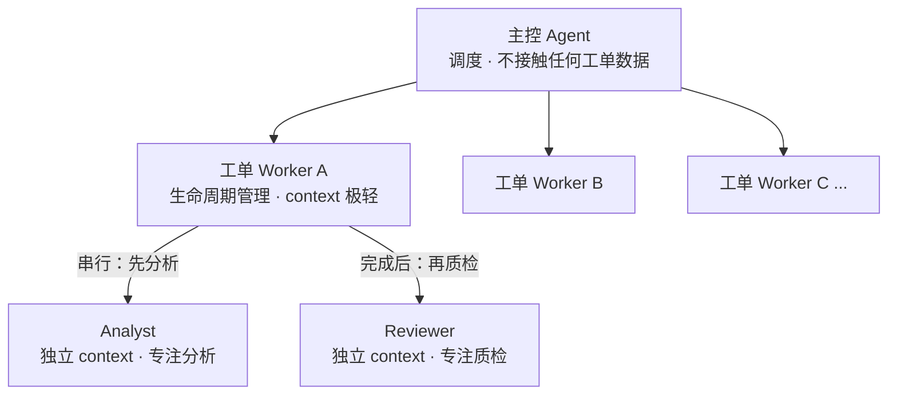
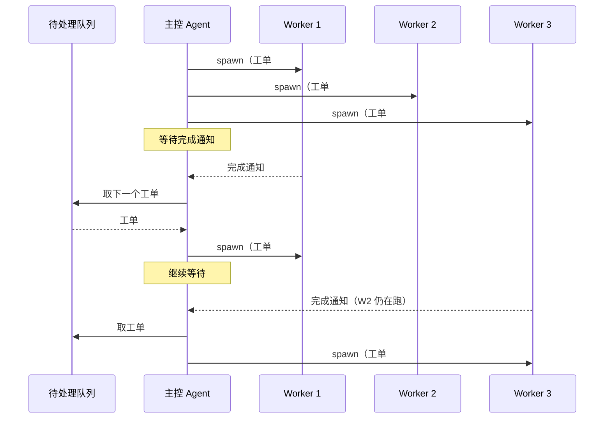
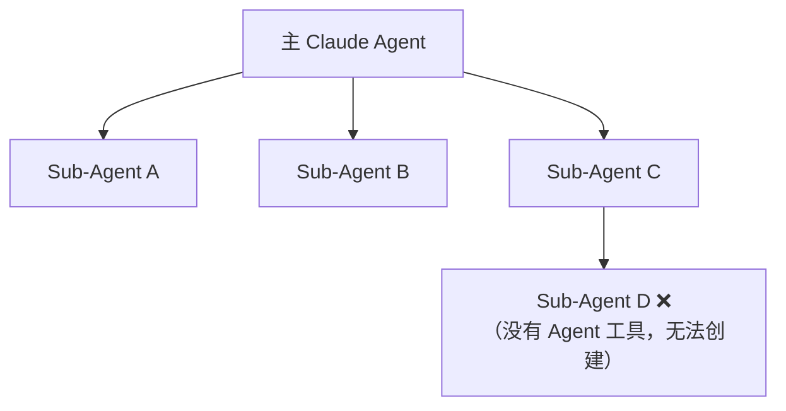
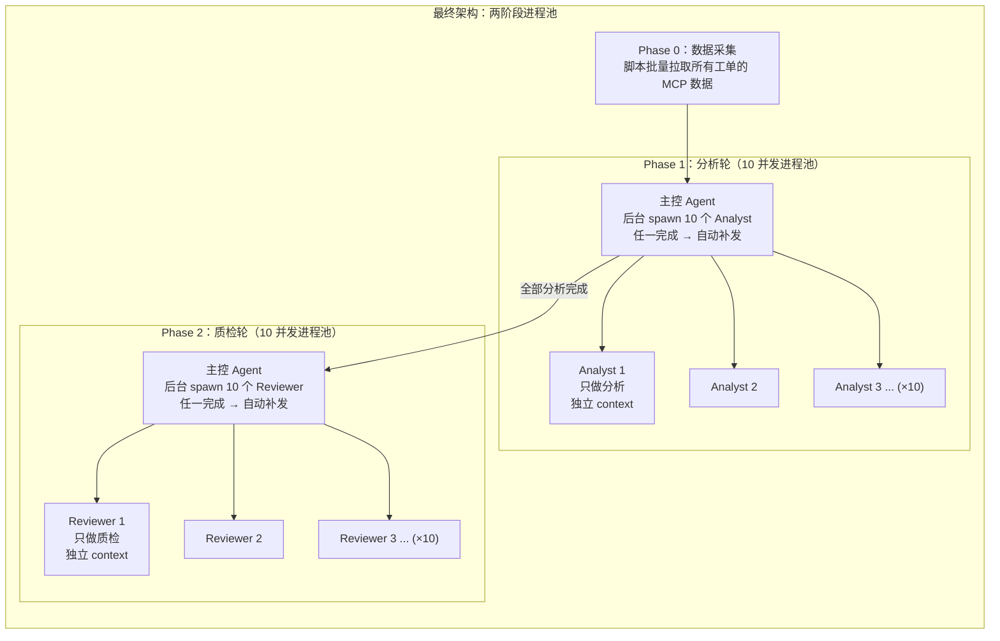
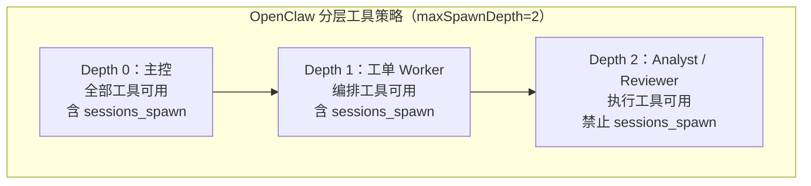
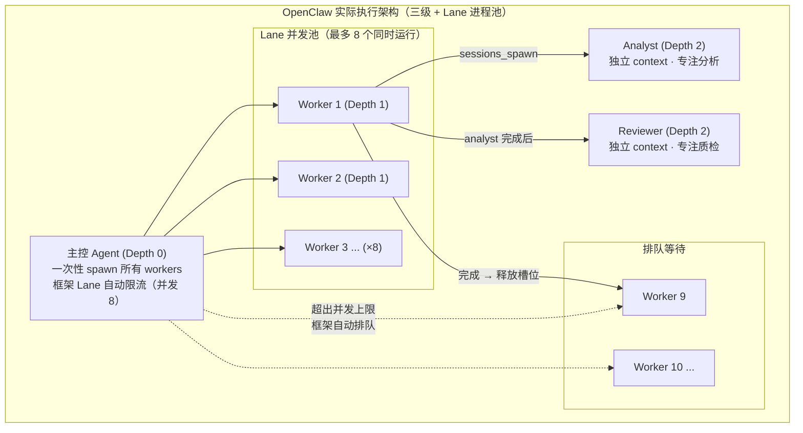
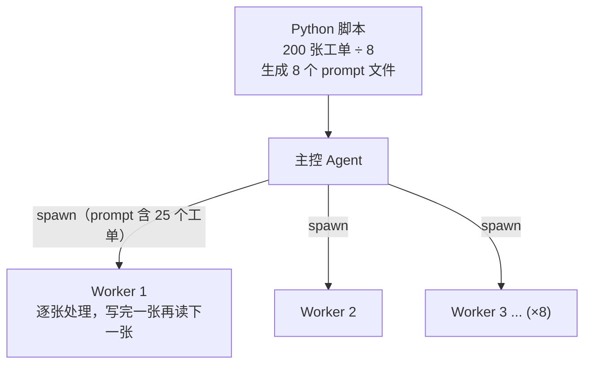
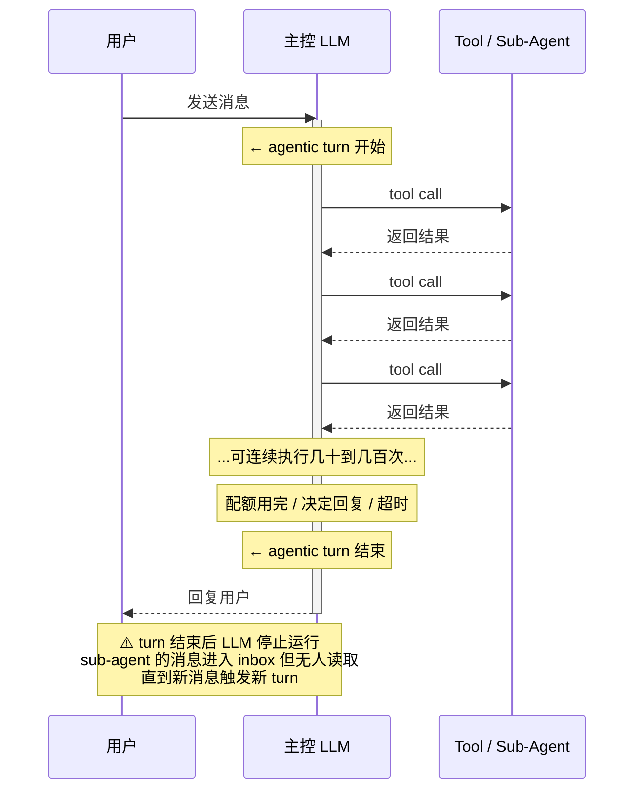
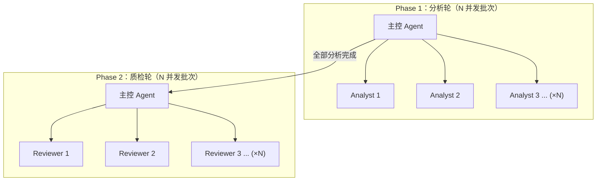
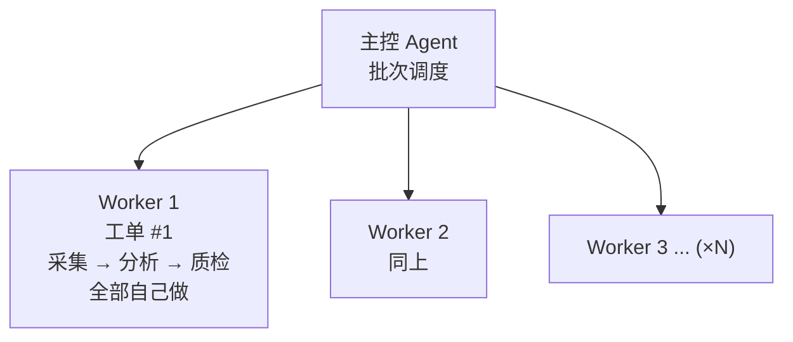

-------------------------------------------------------------------------------------

版权声明：

本文章内容在非商业使用前提下可无需授权任意转载、发布。

转载、发布请务必注明作者和其微博、微信公众号地址，以便读者询问问题和甄误反馈，共同进步。

微博：https://weibo.com/orroz/

博客：https://zorrozou.github.io/

微信公众号：**Linux系统技术**

-------------------------------------------------------------------------------------

# Sub-Agent 批处理架构设计：确定性与非确定性的分工边界

## 前言

2026年，AI编程工具已经从"帮你补全一行代码"进化到了"帮你管一支团队干活"。但"管一支团队干活"这个能力到底成不成熟，各家工具之间差距有多大，只有在真实的复杂场景中才能暴露出来。

大多数关于 AI Agent 的文章都在讲概念：工作流、多智能体、任务分解……但很少有人讲清楚，当你真的把一两百个工单扔给 AI 去批量处理的时候，会踩哪些坑、卡在哪些地方、最终用什么方案跑通的。

本文从一个真实的重负载场景出发，推导出对 Sub-Agent 的具体需求，再拿这份需求去横评 2026 年七款主流 AI 编程工具——**不是看宣传，是实测打表**。我用 CodeBuddy、Claude Code、OpenClaw 三款工具分别实际跑过多轮工单批处理（每轮 100-200 个，累计几千个），每款工具的架构方案和最终效果都有一手体感。

但这篇文章想讲的不只是工具选型。在 12 个版本的迭代过程中，我越来越清楚地意识到：**AI 时代工程师的核心工作正在从"写代码"变成"设计让 AI 能稳定工作的系统"。** 工具横评只是载体，背后真正的问题是——当 AI 能做越来越多的执行工作时，工程师应该把自己放在哪里？

> **核心结论先放这里：**
> - **把确定性工作从 AI 手里拿走，是 Agent 系统稳定性的第一原则。** 调度是确定性工作（计数、状态追踪、补发决策），交给框架或脚本做，系统就稳定；交给 LLM 模拟，系统就脆弱——"该补 1 个补了 8 个""一直不补导致并发为 0"都是 LLM 做调度器的必然结果
> - **Context 隔离是质量的物理前提，不是设计偏好。** 分析和质检放在同一个 agent 里跑（胖 worker），到质检阶段 context 已经被中间推理污染，字数超限和白名单遗漏检不出来；拆成独立 agent 后同样的工单、同样的模型，问题全部被正确检出
> - **三款工具实测，各有最佳实践。** Claude Code 靠框架级进程池实现确定性调度；OpenClaw 靠 Lane 并发控制 + 三级嵌套实现最佳 context 隔离；CodeBuddy 靠脚本预分配绕过 LLM 调度。殊途同归——都在把确定性工作从 LLM 手里拿走
> - **多级 sub-agent 嵌套**：OpenClaw 是唯一经实测确认支持的工具（需配置 `maxSpawnDepth>=2`）
> - **没有一个工具全面最强**：选工具要先想清楚你的任务结构——是需要深层嵌套、高并发调度，还是精细的模型混搭

---

## 一、从一个真实任务说起

### 1.1 任务是什么

我在日常工作中持续使用 AI 工具做安灯（Andon）平台事件工单的批量分析，每轮处理 100-200 个工单，累计处理了几千个。对每张工单，需要：

1. 从 MCP 数据源采集多类原始数据（工单详情、操作流水、群消息、关联问题单、关联需求单等）
2. 读取这些 JSON 文件，深度分析工单的现象、根因、建议措施
3. 生成一份结构严格的 Markdown 分析报告
4. 对报告做自动质检：字数限制、白名单过滤、格式合规
5. 质检不通过的自动修复

每轮 100-200 个工单，每张都要走完这个流程，涉及数千次 API 调用和文件操作。

**单张工单的数据量级**：

这个量级是理解后文架构设计的关键，所以有必要先铺垫一下。每张工单需要采集的原始数据包括：

| 数据项 | 典型大小 | 说明 |
|--------|---------|------|
| 工单基础信息 | 2-5 KB | 标题、客户、状态、归档路径等几十个字段的 JSON |
| 操作流水 | 10-80 KB | 工单全生命周期的每一步操作记录，复杂工单可达 60+ 条流水 |
| 群消息记录 | 20-600 KB | 企微群内的技术讨论，活跃工单可达数百条消息 |
| 通话录音转文字 | 0-50 KB | 部分工单有电话沟通的 ASR 转写 |
| 关联问题单 | 0-10 KB | 不是每张都有 |
| 关联需求单 | 0-10 KB | 不是每张都有 |

**单张工单的原始数据合计约 50KB-750KB，转换成 token 约 1.5 万-25 万 token。** 即使经过 condense_data.py 压缩掉 85% 的冗余字段，复杂工单的精简数据加上分析推理过程仍然会产生 3-10 万 token 的 context 消耗。

当前主流模型的 context window 已达 1-2M token，单张工单的数据量早已不是物理瓶颈。但 context 隔离依然是刚需，原因有两个：

**第一，注意力劣化。** LLM 的有效注意力并不随 context window 线性增长。当 context 中填满了前序工单的中间推理过程（每张工单产生 3-5 万 token 的思考链），FORMAT_SPEC 和白名单规则被"淹没"在几十万 token 的噪声中——这就是 "lost in the middle" 效应。实测表明，同一模型处理同一批工单，胖 worker（分析 + 质检共享 context）比两阶段隔离架构的质检合格率明显更低，根因就是 context 污染导致 LLM 对格式规范的遵从度下降。

**第二，成本控制。** 每张工单的实际 context 需求只有几万 token，隔离后 worker 可以选用 128K 甚至更小 context 的廉价模型（如 Sonnet、Haiku、DeepSeek-V3、GLM-4-Flash、MiniMax-Text），而不是被迫为所有 worker 配置百万级 context 的旗舰模型。当批量处理几百张工单时，模型单价的差异会被放大到数量级的成本差距。

这就是为什么必须做 context 隔离——**不是 context window 装不下，是装得下但质量会劣化、成本会失控**。

### 1.2 为什么不能串行跑

先算一笔账：单张工单完整处理约 3-5 分钟（MCP 采集 + LLM 分析 + 质检修复），100-200 个串行跑就要十几个小时。并行是必须的。

但**并行不是简单地一次性启动几百个 agent**。这里有三个物理约束：

1. **上百个 MCP 请求同时发出 → 大量超时**：服务端扛不住瞬间并发，返回大量空文件（0 字节）
2. **单 agent 上下文污染**：让一个 agent 串行处理大量工单，中间推理噪声不断累积，后续工单的格式遵从度和质检准确率显著下降
3. **质检员和分析员并行启动 → 质检员等不到报告**：分析还没完成，质检就开始读文件了

这三个约束决定了架构必须满足：**context 隔离、有限并发、阶段串行**。

---

## 二、需求推导：架构是怎么来的

### 2.1 为什么需要"一个工单一个 sub-agent"

**上下文隔离**是核心原因。

每张工单的原始数据加起来几千到几万行。如果在一个 agent 的 context 里同时处理多张工单，到第 3 张时，第 1 张的数据已经被挤出 context window，分析质量断崖式下降。

**第一条铁律：一个工单一个独立的 sub-agent，各自有自己的 context window，互不污染。**

### 2.2 为什么需要"三级"而不是"两级"

两级架构（主控 agent → 工单 sub-agent）看起来也能跑，但有一个关键问题：**工单 sub-agent 的 context 会膨胀到不可控**。

一个工单 sub-agent 要做：
- 数据采集确认（读多个文件，检查大小）
- **分析**（读多个 JSON，生成完整报告——大量 context 消耗）
- **质检**（重新读报告，逐项检查，修复——又消耗大量 context）

如果这三步都在同一个 sub-agent 的 context 里完成，到质检阶段，前面的中间推理过程已经占满了 context，质检准确性下降。

三级架构的解法：



工单 worker 自己只做"检查数据 → 启动 analyst → 确认完成 → 启动 reviewer → 确认完成 → 汇报"，全程不接触任何文件内容，context 始终保持极轻。analyst 和 reviewer 各自在独立的 context window 里工作，互不影响。

这就是三级架构的核心价值：**通过 sub-agent 嵌套调用隔离 context，让每一层 agent 都在最纯净的环境里做自己最擅长的事**。

> **关键需求**：sub-agent 内部必须能串行调用下一级 sub-agent。这不是"递归嵌套"，而是固定的两层调用：主控启动工单 worker，工单 worker 再启动 analyst/reviewer。对工具来说，关键是 sub-agent 的工具集中是否包含启动下级 sub-agent 的能力。

### 2.3 调度的核心问题：谁来管理并发

确定了"每工单一个 sub-agent"之后，下一个问题是：**几百个 sub-agent 怎么调度？**

最朴素的做法是**批次模式**：发 10 个 sub-agent，等 10 个全部完成，再发下一批。这里有一个明显的效率问题——如果 9 个 2 分钟完成，第 10 个需要 8 分钟，9 个完成后要干等 6 分钟。这就是**尾延迟**问题。

理论上的最优解是**滑动窗口**：任何一个完成 → 立即从队列取下一个 → 启动新 worker，始终保持满负荷运行。



但这里隐藏着一个关键问题：**滑动窗口需要一个调度器，而调度器需要做的全是确定性工作**——计数当前有几个 worker 在跑、跟踪谁完成了谁没完成、决定补发几个。这些工作对程序来说是 trivial 的（一个 counter 变量 + 一个 for 循环），但对 LLM 来说是根本性的挑战。

**LLM 的推理本质是概率性的文本生成，它不擅长：**

- **精确计数**："当前有几个 worker 在跑？" → 在几十轮 spawn/完成的交错历史中提取准确数字
- **状态追踪**："worker 3 完成了，worker 5 还没完成，所以空闲槽 = ?" → 需要从 context 中精确回溯
- **条件分支的严格执行**："if 空闲槽 == 1 then 只补 1 个" → LLM 可能补 0 个也可能补 8 个

**这意味着：滑动窗口好不好用，完全取决于调度逻辑由谁来执行——工具框架，还是 LLM。** 如果框架层面接管了并发计数、完成通知、补发决策这些确定性工作，滑动窗口就是稳定高效的；如果这些逻辑交给 LLM 模拟，滑动窗口就是脆弱低效的。

而批次模式的优势恰恰在于**回避了这个问题**：LLM 只需要做一个极简的判断——"这一批全部完成了吗？完成了就起下一批"。没有计数，没有状态追踪，没有条件分支。在 agent 的 turn-based 执行模型下，N 个 worker 可以压缩到一条消息里的 N 个并行 tool call，整个调度只需要几个 turn。

**所以真正的需求不是"必须用滑动窗口"，而是：调度逻辑必须是确定性的。** 框架原生支持滑动窗口就用滑动窗口，不支持就用批次——批次虽然有尾延迟，但它的确定性远远好于 LLM 模拟的滑动窗口。

### 2.4 为什么需要 stagger delay

多个 sub-agent 同时启动，每个第一步都是调用多个 MCP 接口采集数据。几十个请求在 1 秒内涌入服务端，直接触发限流。

解决方案很简单：每个 sub-agent 启动间隔几秒，请求自然分散。

### 2.5 需求总结

| 需求 | 原因 |
|------|------|
| **三级架构**（主控 → 工单 worker → analyst/reviewer） | context 隔离，每层职责单一 |
| **sub-agent 内可调用下级 sub-agent** | worker 确认 analyst 完成后才启动 reviewer，固定两层 |
| **确定性的并发调度** | 框架原生支持进程池最优，否则批次模式或脚本预分配兜底 |
| **stagger delay** | 分散 MCP 请求，避免 429 |
| **失败自动回队重试** | 限流导致的临时失败不应阻塞整体 |
| **per-agent 独立 context** | 每个 agent 在纯净环境中工作 |
| **prompt 通过文件传递** | 下级 sub-agent 的 prompt 包含完整格式规范（几千字），超过参数限制 |

> **剧透**：后文横评会发现，"sub-agent 内可调用下级 sub-agent"这一条，在大多数工具上默认不支持。唯一的例外是 OpenClaw——配置 `maxSpawnDepth>=2` 后可开启。对于不支持的工具，务实方案是降级为"两级架构 + 两阶段进程池"或"列表模式"，详见第八节。

---

## 三、横评：谁能满足这些需求

带着这份需求清单，逐一审视 2026 年主流的 AI 编程工具。

### 3.0 参赛选手一览

| 工具 | 厂商 | 形态 | 版本基线 |
|------|------|------|---------|
| Claude Code | Anthropic | CLI 终端 | 2026.4 |
| CodeBuddy | 腾讯 | CLI / IDE / 插件 | 2026.4 |
| OpenClaw | 开源社区 | 自托管 Agent Gateway | v2026.4.9 |
| Cursor | Anysphere | IDE | 3.0 (Glass) |
| Codex CLI | OpenAI | CLI 终端 | v0.116+ (2026.3) |
| Trae | 字节跳动 | IDE + SOLO 独立端 | 2026.4 |
| Gemini CLI | Google | CLI 终端 | 2026.4 |

> **注**：CodeBuddy 的多种产品形态经实测确认，暴露给 LLM 的 Sub-Agent 工具集是同一套，合并为一项评价。
>
> **⚠️ 实测范围说明**：本文中 **Claude Code、CodeBuddy、OpenClaw** 三款工具的 Sub-Agent 能力均经过实际工单批量处理验证（每轮 100-200 个工单，多轮累计几千个），结论基于一手体感。**Cursor、Codex CLI、Trae、Gemini CLI** 四款工具的信息来源为官方文档和公开资料，**相关功能未经实测**。后文中涉及这四款工具的能力描述、评分和推荐，均以文档信息为准，实际表现可能与文档描述存在差异。

---

### 3.1 Claude Code——框架级进程池，自动补发

Claude Code 的 Sub-Agent 能力在所有工具中最为完整，但核心优势不在某个单一功能，而在于**框架层面实现了真正的进程池调度——agent 完成后自动通知主控，主控立即补发，全程无需 LLM 做计数或状态追踪**。

**验证嵌套**：输入"请创建一个 sub-agent A，在 A 的 prompt 中明确要求它再创建一个 sub-agent B 来读取文件列表"。结果：Agent A 报告说它的工具集中没有 Agent 工具，无法创建 Agent B，它直接自己用 Glob 工具完成了文件读取。也就是说，Claude Code 的 sub-agent 拥有 Bash、Read、Glob、Grep 等执行工具，但**没有 Agent 工具**。架构是**单层设计**：



**但 Claude Code 在调度维度上的领先是根本性的：**

理解 Claude Code 为什么好用，关键在于理解它的框架做了什么：

1. **并行 tool call**：一条消息里可以同时 spawn 10 个 Agent，框架层面并行启动 10 个独立子进程。"启动一批 worker"只占 1 个 turn
2. **后台执行 + 自动通知**：`run_in_background` 让 agent 在后台运行，完成后框架**自动通知主控**。主控不需要等所有 agent 都完成才能行动——任何一个完成，主控就被唤醒
3. **结构化完成通知**：每个 agent 完成时，框架返回结构化的结果。LLM 收到的是明确的"agent X 完成了，结果是 Y"，不需要从 context 里翻找
4. **主控可立即补发**：收到完成通知后，主控可以在同一个 turn 内并行 spawn 新的 agent 填补空位

这四个特性的组合效果是：**Claude Code 实现了框架级的滑动窗口进程池**。与 CodeBuddy/OpenClaw 的根本区别在于——完成通知、补发触发、并行 spawn 全部是框架的确定性逻辑，LLM 只需要做一个极简判断："队列还有工单吗？有就补发。"

```
主控 spawn 10 个后台 Agent
  ↓
Agent 3 先完成 → 框架自动通知主控
  ↓
主控被唤醒 → spawn Agent 11 补位（1 个 tool call）
  ↓
Agent 7 完成 → 框架通知 → 主控 spawn Agent 12
  ↓
...始终保持 10 并发满负荷
```

**LLM 永远不需要数"当前有几个在跑"**——框架保证了每次唤醒时的状态是明确的（"谁完成了"），LLM 只需决定"补不补"。这是与批次模式（等全部完成再起下一批）和 LLM 模拟滑动窗口（LLM 自己数数）的根本区别。

此外，Claude Code 还提供：
- **Agent Teams**（需启用 `CLAUDE_CODE_EXPERIMENTAL_AGENT_TEAMS=1`）：共享任务列表（TaskCreate/Get/Update/List，支持依赖关系和自动认领）、委派模式（Shift+Tab 限制 leader 只能协调不能动手）
- **Git worktree 隔离**：每个 sub-agent 在独立的代码副本中工作

**我用 Claude Code 实际跑工单的架构：**

由于不支持嵌套，三级架构无法原样实现。最直觉的做法是**"胖 worker"方案**——每个 worker 一条龙完成采集、分析、质检全流程，进程池调度。调度层面非常流畅，并发始终满负荷。**但检查报告质量时发现了问题：质检环节的准确性明显不够。**

原因在于 context 污染：单张工单的原始数据可达 25 万 token，分析阶段读入大量 JSON 并生成报告后，context 中充满了中间推理过程、被截断的 JSON 片段、格式转换的临时输出。到质检阶段，reviewer 需要在这些噪声中找到报告内容并逐项比对，准确性自然下降。**具体表现为：部分报告字数超限（352 字 vs 300 字上限）没被检出、个别非白名单工程师被遗漏。**

于是改为**"两阶段进程池"方案**——先用 10 并发进程池跑完所有工单的分析，全部完成后再用 10 并发进程池跑质检。每个 agent 只做一件事，context 始终纯净：



**实际效果**：每个 analyst 只读裁剪后的数据 + 生成报告，每个 reviewer 只读报告 + 做质检修复，context 互不污染。**之前胖 worker 方案遗漏的字数超限和白名单问题，在两阶段方案中全部被正确检出**——同样的工单、同样的模型，唯一的区别是 context 是否纯净。框架级进程池保证了并发始终满负荷，任何 analyst 完成后主控立即补发下一个。代价是多了一轮调度开销，但质检准确性的提升远远值得。

> **结论**：Claude Code 的核心优势在于框架实现了真正的进程池——后台执行、自动完成通知、主控被唤醒后立即补发，全程是框架的确定性逻辑。LLM 不需要计数、不需要追踪状态、不需要判断补发时机。不支持嵌套是硬伤，但两阶段进程池是足够好的降级方案。

---

### 3.2 OpenClaw——唯一支持多级嵌套，Announce 唤醒有可靠性风险

OpenClaw 定位是"AI Agent 协作操作系统"，Sub-Agent 能力有独特亮点：

- **嵌套深度**：`maxSpawnDepth` 可配 1-5 层（默认为 1，**需手动开启**），三级架构可以实现
- **分层工具策略**：按 depth 自动收紧工具权限——depth 0 有全部工具，depth 1 有编排工具（可以 spawn），depth 2 是叶子节点（禁止 spawn）。这比 Claude Code 更精细
- **级联停止**：`/stop` 可以级联停止所有子节点
- **双向通信**：`sessions_send` 支持对等双向通信 + ping-pong
- **非阻塞 spawn**：`sessions_spawn` 立即返回 `runId` 和 `childSessionKey`，不等待子任务完成



**OpenClaw 的完成通知机制：Announce**

OpenClaw 有自己的被动唤醒机制，分三层：

1. **结果冻结**：子 Agent 完成时，结果冻结到 `SubagentRegistry`（最终回复的 100KB 快照）
2. **Sweeper 扫描**：后台 Sweeper 每 1-8 秒扫描一次已完成任务
3. **Announce 投递**：以 `[Subagent Completion]` 系统消息注入父 Agent 会话，触发父 Agent 新一轮 ReAct 循环

多个子 Agent 同时完成时，per-session 的 Announce 队列支持防抖合并。失败重试采用指数退避（1s→2s→4s→8s，最多 3 次）。

**理论上这足以实现滑动窗口**——子 Agent 完成 → Announce 唤醒父 Agent → 父 Agent 补发新的子 Agent。但实际存在两个问题：

1. **Announce 可靠性不足**：通知可能丢失（网络超时、父 session 已 yield），OpenClaw 社区为此引入了 Mandatory Callback Protocol 作为补充——要求子 Agent 必须显式调用 `sessions_send` 发送结构化完成报告。这说明 Announce 机制本身不够可靠
2. **补发决策仍由 LLM 执行**：父 Agent 被唤醒后，"该不该补发、补几个"的判断仍然是 LLM 在推理。与 Claude Code 的区别在于：Claude Code 的框架保证了每次唤醒时的状态是明确的（"谁完成了"直接作为结构化 tool result 返回），OpenClaw 的 Announce 是系统消息注入，LLM 需要从 context 中解析

**并发控制：框架级 Lane 进程池**

OpenClaw 采用 Lane 分车道并发模型——主 Agent lane 并发 4，子 Agent lane 并发 8，每个父 Agent 最多 5 个子 Agent（`maxChildrenPerAgent: 5`）。**关键在于：这个并发上限是框架强制执行的。** 当 spawn 请求超过上限时，框架自动排队等待；有子 Agent 完成释放槽位后，排队的 spawn 自动执行。

这意味着 OpenClaw **天然就是进程池模式**——LLM 不需要自己做并发管理，只需要一次性把所有工单都 spawn 出去，框架自动控制同时运行的上限。与 Claude Code 的进程池相比，区别在于：

| 维度 | Claude Code | OpenClaw |
|------|------------|----------|
| **进程池由谁管理** | 框架（后台执行 + 完成通知 + LLM 逐个补发） | 框架（Lane 并发上限 + 自动排队） |
| **LLM 需要做什么** | 收到完成通知 → 判断"补不补" | **一次性 spawn 全部** → 框架自行管理并发 |
| **完成通知** | 结构化 tool result，确定性返回 | Announce 系统消息，有丢失风险 |

OpenClaw 的 Lane 模型在调度层面甚至比 Claude Code 更简单——LLM 连"补发"都不需要做，直接把所有工单 spawn 出去就行。**但 Announce 的可靠性问题仍然存在**：通知丢失意味着父 Agent 可能不知道某个子 Agent 已经完成了，无法及时处理结果或做后续编排。

**我用 OpenClaw 实际跑工单的架构：**

OpenClaw 是唯一能跑完整三级架构的工具，配置 `maxSpawnDepth: 3` 后，worker 内部可以串行 spawn analyst 和 reviewer。调度层面最务实的做法是**让框架自己管理并发**——主控一次性 spawn 所有工单的 worker，Lane 机制自动保证同时最多 8 个在跑：



**为什么不让 LLM 做批次管理？** 因为框架已经在做了。Lane 的并发上限就是进程池大小，LLM 手动分批反而是画蛇添足——它需要自己数"这一批完成了几个"，而这正是 LLM 不擅长的事。不如一次性全 spawn，让框架排队。

**实际效果**：三级架构完整跑通，analyst 和 reviewer 各自在纯净 context 中工作，**质检准确性是三款工具中最好的**——这得益于三级架构的 context 隔离。Lane 进程池保证了并发始终满负荷，没有批次模式"等最慢的"问题。但 Announce 的可靠性问题在实测中遇到过——某个 worker 完成后 announce 消息未送达主控，导致该工单结果被遗漏，需要手动补跑。**架构最理想、质检最好，但 Announce 可靠性需要关注。**

> **结论**：OpenClaw 是目前唯一经过实测确认支持多级 sub-agent 调用的工具（需配置 `maxSpawnDepth>=2`）。Lane 并发控制提供了框架级进程池，LLM 一次性 spawn 全部工单即可，无需手动分批。但 Announce 完成通知存在丢失风险，生产使用需要额外的校验机制（如脚本检查报告文件完整性）。

---

### 3.3 CodeBuddy——消息基础设施完备，但调度仍依赖 LLM

CodeBuddy 是我最早用来跑工单的工具，也是用得最多的。它的 Sub-Agent 能力：

- **自定义 Subagents**：支持 agentic（主 agent 自动调度）和 manual（替代主 agent）两种模式，通过 Markdown 配置文件定义，可指定 System Prompt、Tools、MCP、model
- **team 模式**：`team_create`、`send_message`（支持 message/broadcast/shutdown_request/plan_approval_response）、`team_delete`
- **消息唤醒**：worker 通过 `send_message` 发送的消息，会以 `<teammate-message>` 的形式自动触发 main agent 一个新 turn，效果上等价于 `receive_message`
- **Plan 模式**：AI 先制定任务清单，经用户确认后才执行
- **Skills**：支持 Skills 预加载，`.codebuddy/skills/` 目录，有 Skills 市场
- **per-agent 配置**：model、tools、MCP 都可以 per-agent 指定

硬伤有两个：**不支持嵌套**（sub-agent 不能再 spawn sub-agent）；**调度决策由 LLM 执行**。

第二点是与 Claude Code 的根本区别：

| 维度 | Claude Code | CodeBuddy |
|------|------------|-----------|
| **spawn N 个 worker** | 1 条消息，N 个并行 tool call → 1 个 turn | LLM 决定 spawn 几个、逐个或批量 spawn |
| **"谁完成了"** | 框架打包 N 个结果，结构化返回 | 每个 worker 发 send_message，LLM 从 context 中识别 |
| **"该补发几个"** | 框架保证 turn 边界状态干净，LLM 只需判断"队列还有吗" | LLM 需要从 context 历史中计算当前运行数、空闲槽数 |
| **主控 context 增长** | 每个完成通知是结构化 tool result | 每个 worker 完成 = 1 个新 turn（N 个 turn） |

CodeBuddy 的消息唤醒机制解决了"main 被动等待，零 token 消耗"的问题，但 **main 被唤醒后需要做的补发决策——当前有几个 worker 在跑、空闲几个槽、该补发几个——仍然是 LLM 在推理**。精确计数和状态追踪是确定性逻辑，LLM 的概率性文本生成本质与之冲突。实测中出现过"该补 1 个补了 8 个"和"一直不补导致并发降为 0"的情况。

此外，如果用长驻 Actor 模式（Worker 持续运行、反复接收任务），还会遇到 **Worker 静默死亡**问题——`max_turns` 耗尽后 Worker 静默退出，没有退出码、没有死亡信号、没有心跳。177 张工单实战中，5 个 Worker 在处理约 117 张后集体停止响应，主控 9 分钟后才通过人工发现。

**我用 CodeBuddy 实际跑工单的最终架构：列表模式**

既然问题的根源是"LLM 不适合做调度器"，最彻底的解法是**不让 LLM 做调度**。用 Python 脚本预先将工单列表分配给 N 个 Worker，spawn 时直接把待处理工单列表写入 worker 的 prompt，Worker 自主连续处理，无需 main 逐个分配。比如 200 张工单分给 8 个 Worker，每个 Worker 自主处理约 25 张（`max_turns=200`，`bypassPermissions`），零通信开销。



**这个方案有一个明确的 trade-off：context 退化。** 每张工单处理完后，前面工单的中间推理过程仍留在 Worker 的 context 中。处理到第 10 张以后，context 变长，Worker 对格式规范的注意力开始衰减——与 7.3 节讨论的 prompt 漂移问题叠加。实测中后半段工单的格式合规率确实低于前半段。

但这是一个**有意识的 trade-off**：接受 context 退化带来的质量下降，换取调度的完全确定性。在 CodeBuddy 上，可选项只有三个：（1）让 LLM 做调度器 → 计数错误、并发失控；（2）列表模式 → context 退化但流程可靠；（3）减少每个 Worker 的工单数、增加 Worker 数量 → 退化减轻但 spawn 开销增加。实际操作中取折中值（每 Worker 8-15 张），配合阶段 3 的 Python 脚本全量质检来兜底。

这个方案本质上是**把调度逻辑从 LLM 转移到了脚本**——Python 脚本做确定性的工单分配，LLM 只做需要语义理解的分析工作。与 Claude Code 的框架级调度殊途同归：**都是把确定性工作从 LLM 手里拿走，只是实现层面不同——一个靠框架，一个靠脚本。**

> **结论**：CodeBuddy 的 team mode 提供了完备的消息基础设施，但调度决策仍由 LLM 执行。务实的做法是用列表模式绕过 LLM 调度，用脚本接管确定性工作。不支持嵌套是另一个硬伤。

---

### 3.4 Cursor——多 agent 并行但无嵌套无通信（文档信息，未实测）

Cursor 3.0（代号 Glass）在 2026 年 4 月发布了 Agents Window，据官方文档：

- **多 agent 并行**：支持在不同本地仓库、worktree、云端、远程 SSH 环境中同时运行多个 agent（官方未标注具体上限）
- **Await 工具**：可以等待 sub-agent 完成或等待特定输出（如"Ready"或"Error"）
- **原生 worktree 隔离**：每个 agent 在独立的 Git worktree 中工作，天然避免多 agent 同时写文件的冲突
- **best-of-N**：同一个 prompt 可以同时发给多个 model，比较结果选最优
- **Cloud Agent**：本地和云端无缝切换

但不支持 sub-agent 嵌套，也没有 agent 间直接通信机制。

> **结论**：Cursor 适合 IDE 内的并行开发场景（前后端并行、多模型对比、Cloud Agent 后台执行），IDE 集成度最高。不适合需要层级编排的复杂任务。

---

### 3.5 Codex CLI——CSV 批量是杀手锏（文档信息，未实测）

据官方文档，OpenAI 的 Codex CLI 在 2026 年 3 月 GA 后，最大亮点是 `spawn_agents_on_csv`：

- 读一个 CSV 文件，每行自动创建一个 worker agent
- 支持 `max_concurrency` 控制并发
- 结果自动导出为新 CSV
- 每个 worker 有独立的 `job_max_runtime_seconds` 超时

这个功能对工单分析场景非常诱人——CSV 里就是工单列表，天然适配。但：

- 嵌套只有 1 层（`max_depth` 默认 1，sub-agent 不能再 spawn）
- CSV 模式的 worker 只能调用 `report_agent_job_result` 返回结果，不能内部启动子任务
- 没有 agent 间通信

> **结论**：Codex CLI 的 CSV 批量是独特优势，适合"每行独立处理，不需要嵌套子任务"的场景。不支持深层嵌套，不适合需要 worker 内部分工的三级架构。

---

### 3.6 其他工具速评（文档信息，未实测）

**Trae（字节跳动）**：SOLO Coder 可以自动调度自定义 sub-agent，GUI 创建 agent 门槛最低。但嵌套深度未经实测确认，无精细并发控制，无 agent 间通信。适合快速原型开发和 UI/UX 场景。

**Gemini CLI（Google）**：per-agent 的 tools/model/MCP/policy 控制是最精确的，还支持 A2A 远程 agent 协议。但不支持递归嵌套，并行执行仍标记为实验性。适合需要精确工具隔离和安全策略的场景。

---

### 3.7 多级嵌套验证

用同一句提示词测试所有工具：**"请创建一个 sub-agent A，在 A 的 prompt 中明确要求它再创建一个 sub-agent B 来读取文件列表。"**

| 工具 | 结果 | A 的行为 | B 是否被创建 |
|------|---------|---------|------------|
| **OpenClaw**（maxSpawnDepth=3） | ✅ 成功 | A 通过 `sessions_spawn` 创建了 B | ✅ B 读取了文件列表，结果逐级返回 |
| **OpenClaw**（默认配置） | ❌ 失败 | A 尝试 `sessions_spawn` 但工具不可用 | ❌ A 自己读了文件 |
| **Claude Code** | ❌ 失败 | A 报告没有 Agent 工具 | ❌ A 用 Glob 自己读了文件 |
| **CodeBuddy** | ❌ 失败 | A 报告没有 Task 工具 | ❌ A 用 list_dir 自己读了文件 |
| Cursor / Codex CLI / Trae / Gemini CLI | ❌ 失败 | A 自己完成了任务 | ❌ |

> **注**：嵌套验证中，Claude Code、CodeBuddy、OpenClaw 三款为实测结果。Cursor、Codex CLI、Trae、Gemini CLI 基于文档描述的 sub-agent 工具集判断，未做实际验证。

---

## 四、横评总结

### 4.1 关键能力全景

**嵌套层级：**

| 工具 | sub-agent 内调用下级 | 分层工具策略 | 级联停止 |
|------|---------------------|-------------|---------|
| Claude Code | ❌ 不支持（实测确认） | 无自动分层 | 无 |
| CodeBuddy | ❌ 不支持（实测确认） | 无 | 无 |
| **OpenClaw** | **✅ 配置 maxSpawnDepth>=2 后支持（实测确认）** | **按 depth 自动收紧** | **/stop 级联** |
| Cursor | ❌ 不支持（文档） | 无（文档） | 无（文档） |
| Codex CLI | max_depth 可配，默认 1（文档） | 无（文档） | 无（文档） |
| Trae | 有 Sub Agent，嵌套深度未确认（文档） | 无（文档） | 无（文档） |
| Gemini CLI | ❌ 不支持（文档） | 无（文档） | 无（文档） |

**并发管理与调度：**

| 工具 | 最大并发 | 调度确定性 | 后台非阻塞 | 失败回队重试 | stagger delay | CSV 批量 |
|------|---------|-----------|-----------|------------|--------------|---------|
| Claude Code | **多 agent 并行（无文档上限）** | **框架级：后台执行 + 自动完成通知 + 并行 spawn 补发** | **run_in_background** | 手动重试（启动新 subagent） | 主控可自行控制间隔 | 无 |
| CodeBuddy | 无文档上限 | **LLM 推理：teammate-message 唤醒但调度决策由 LLM 执行** | team member 异步 | 无 | 主控可自行控制间隔 | 无 |
| OpenClaw | **子 Agent lane 并发 8** | **框架级：Lane 并发上限 + 自动排队（进程池）；Announce 完成通知有丢失风险** | spawn 非阻塞 | 指数退避重试（1-8s，3 次） | 主控可自行控制间隔 | 无 |
| Cursor | 多 agent 并行（文档未标上限） | Await 工具（文档） | Cloud Agent（文档） | 无（文档） | 无（文档） | 无 |
| Codex CLI | 默认 6（max_threads 可配，文档） | 框架级：CSV 引擎管理（文档） | 无（文档） | CSV 标记错误（文档） | 无（文档） | spawn_agents_on_csv（文档） |
| Trae | 多窗口并行（文档） | SOLO Coder 自动调度（文档） | 并行 SOLO（文档） | 无（文档） | 无（文档） | 无 |
| Gemini CLI | 有限·实验性（文档） | 不支持（文档） | 无（文档） | 无（文档） | 无（文档） | 无 |

**团队协作：**

| 工具 | Agent 间通信 | 共享任务列表 | 计划审批 | 委派模式 | Skills 预加载 |
|------|-------------|------------|---------|---------|-------------|
| Claude Code | **SendMessage（需 Agent Teams 实验性 flag）** | **TaskCreate/Get/Update/List** | **Plan Mode** | **Shift+Tab 委派** | skills: 字段 |
| CodeBuddy | **send_message + teammate-message 双向** | 无 | **Plan 模式** | 无 | **支持** |
| OpenClaw | **sessions_send 双向** | 无 | 无 | 无 | 不支持 |
| Cursor | 无（文档） | 无（文档） | 无（文档） | 无（文档） | 无（文档） |
| Codex CLI | 子→父（文档） | 无（文档） | 无（文档） | 无（文档） | 无（文档） |
| Trae | 无（文档） | 无（文档） | 无（文档） | 无（文档） | 无（文档） |
| Gemini CLI | 子→父（文档） | 无（文档） | 无（文档） | 无（文档） | 无（文档） |

### 4.2 评分与排名

| 排名 | 工具 | 嵌套深度 | 并发管理 | 团队协作 | 核心优势 | 核心短板 |
|------|------|---------|---------|---------|---------|---------|
| **1** | **Claude Code** | ★☆☆☆☆ | ★★★★★ | ★★★★☆ | 框架级进程池·后台执行+自动完成通知+即时补发·per-agent model·共享任务列表·Git worktree | 单层设计·Agent Teams 需实验性 flag |
| **2** | **OpenClaw** | ★★★★☆ | ★★★★☆ | ★★★☆☆ | 唯一多级嵌套·按 depth 自动收紧·级联停止·Lane 框架级进程池·双向通信 | 默认需手动配置·Announce 有通知丢失风险 |
| **3** | **CodeBuddy** | ★☆☆☆☆ | ★★★☆☆ | ★★★☆☆ | 自定义 Subagents·消息唤醒机制·team 模式·Plan 审批·Skills·per-agent 配置 | 无嵌套·调度决策由 LLM 执行（不可靠）·无 Git worktree 隔离 |
| **4** | **Cursor** † | ★☆☆☆☆ | ★★★★☆ | ★☆☆☆☆ | 多 agent 并行·Await·原生 worktree·best-of-N·Cloud Agent | 无嵌套·无 agent 间通信 |
| **5** | **Codex CLI** † | ★★☆☆☆ | ★★★☆☆ | ★☆☆☆☆ | per-agent model/MCP/sandbox·CSV 批量引擎 | 嵌套默认 1 层·无 agent 间通信 |
| **6** | **Trae** † | ★☆☆☆☆ | ★★☆☆☆ | ★☆☆☆☆ | GUI 最易创建 agent·SOLO Coder 自动调度 | 嵌套深度未确认·无精细并发 |
| **7** | **Gemini CLI** † | ★☆☆☆☆ | ★☆☆☆☆ | ★☆☆☆☆ | per-agent 配置最精确·A2A 远程·1M context | 不支持递归·并行实验性 |

> **注**：OpenClaw 嵌套评分为 ★★★★☆ 而非满分，因为默认不支持（需手动配置）且存在已知的结果回传 bug（#52174）。CodeBuddy 并发管理评分为 ★★★☆☆，因为框架提供了消息基础设施但调度决策仍由 LLM 执行，实测存在计数错误、补发遗漏等问题。Claude Code 并发管理满分，因为框架层面保证了调度的确定性。**† 标注的工具评分基于文档信息，未经实测验证。**

### 4.3 场景推荐

| 场景 | 推荐工具 | 原因 |
|------|---------|------|
| 需要确定性高并发调度 | **Claude Code** | 框架级进程池·后台执行+自动完成通知+即时补发 |
| 需要深层嵌套 + 精细工具分层 | **OpenClaw** | 唯一实测支持多级嵌套·按 depth 自动收紧 |
| IDE 内并行开发 + Cloud Agent | **Cursor** † | 多 agent 并行 + worktree + best-of-N |
| 自定义 agent + team 协作 + Skills | **CodeBuddy** | 自定义 Subagents + team 模式 + Plan 审批 + Skills |
| CSV 批量独立处理 | **Codex CLI** † | spawn_agents_on_csv |
| 快速原型 + 低门槛 | **Trae** † | GUI 一键创建 agent |
| 精确工具隔离 + 安全策略 | **Gemini CLI** † | per-agent policy engine |

### 4.4 快速验证：一句话测试嵌套能力

拿到一款新工具，不用看文档，一句话就能测出它的 Sub-Agent 嵌套是否真正可用：

> **"请创建一个 sub-agent A，在 A 的 prompt 中明确要求它再创建一个 sub-agent B 来读取文件列表。"**
>
> 如果 A 自己动手读了文件而没有启动 B，就说明不支持多级调用。

这个测试可以随时用来验证任何工具的最新能力——考虑到 2026 年工具迭代速度，本文的具体评分很可能在你读到时已经变化。

---

## 五、三款工具实战对比：同一批工单，三种跑法

我用 CodeBuddy、Claude Code、OpenClaw 分别跑了同一批工单。三款工具的架构差异在实战中体现得非常明显：

| 维度 | CodeBuddy | Claude Code | OpenClaw |
|------|-----------|-------------|----------|
| **实际架构** | 两级 + 列表模式（脚本预分配，Worker 自主处理） | 两阶段进程池（先全量分析，再全量质检） | 三级原生 + Lane 进程池 |
| **调度由谁执行** | **脚本**（预分配工单列表，LLM 零调度） | **框架**（后台执行 + 自动完成通知 + 即时补发） | **框架**（Lane 并发上限 + 自动排队，LLM 一次性 spawn 全部） |
| **人工干预** | **零** | **零** | 偶尔（announce 丢失需补跑） |
| **并发稳定性** | **好**（Worker 自主运行，不依赖 main 调度） | **好**（框架保证） | **好**（Lane 自动限流） |
| **质检准确性** | 一般（分析和质检共享 context） | 较好（analyst/reviewer 分轮独立 context） | **最好**（三级架构 context 完全隔离） |
| **已知风险** | Worker 内部失败无法向 main 汇报 | 无重大风险 | Announce 通知偶发丢失 |
| **总体评价** | 效率高，但无动态调度且质检受限 | **调度最稳定，质量也好** | **质检最好，需关注 Announce 可靠性** |

> **注**：CodeBuddy 的 team mode 也支持通过 `send_message` + `teammate-message` 实现消息驱动的滑动窗口——main 被动等待 worker 完成通知，收到后立即补发。但 main 被唤醒后的补发决策仍由 LLM 执行，实测中出现了计数错误（该补 1 个补了 8 个）和长驻 Worker 静默死亡（`max_turns` 耗尽无通知）等问题。列表模式（脚本预分配）是更稳定的选择。

**token 成本估算**（200 张工单，8-10 并发）：

- **Claude Code**：主控调度约消耗 ~10K token（进程池模式，完成通知触发补发，等待期间零消耗），analyst 执行约 200×12K = 2.4M token，reviewer 执行约 200×5K = 1M token，**总计约 3.4M token**
- **CodeBuddy**：主控调度约消耗 ~5K token（一次性 spawn 后不再参与），worker 执行约 3M token，**总计约 3.0M token**
- **OpenClaw**：主控调度约消耗 ~10K token（一次性 spawn 全部，Lane 自动管理并发），worker 执行约 2.5M token（三级架构下每个 sub-agent context 更纯净），**总计约 2.5M token**

**真正影响质量的不是调度 token，而是 context 隔离程度**——OpenClaw 三级架构和 Claude Code 两阶段进程池都实现了 analyst/reviewer 的 context 独立，质检质量最好。CodeBuddy 的列表模式虽然调度效率高，但 analyst 和 reviewer 共享 context（胖 worker），质检准确性受限。如果对质检质量要求高，CodeBuddy 也可以采用类似 Claude Code 的两阶段方案（先 N 并发跑分析，再 N 并发跑质检），但每一阶段内的调度仍需考虑 LLM 调度可靠性问题。

---

## 六、深入：Agent 调度的两个范式

这一节分析 Agent 调度的本质问题，是理解不同工具表现差异的关键。

### 6.1 什么是 agentic turn

要理解调度问题，先要理解 **agentic turn** 这个概念。

用户发一条消息后，LLM 进入一个"agentic turn"——在这个 turn 内，LLM 可以连续发起多次 tool call（读文件、写文件、启动 sub-agent、发消息等），不需要等用户的下一条消息。每个 turn 有一个**轮次配额**（max_turns），通常几十到几百轮，决定了 LLM 在一个 turn 内最多能执行多少次 tool call。当配额用完、或 LLM 决定回复用户、或遇到超时/错误时，turn 结束，LLM 进入等待状态。



关键点：**agentic turn 有生命周期**。turn 内 LLM 是活的，可以连续执行工具调用；turn 结束后 LLM 就"睡着了"。

### 6.2 两个调度范式：框架调度 vs LLM 模拟调度

理解了 agentic turn，就能看清 Agent 调度的两个根本不同的范式：

**范式一：框架调度（Claude Code）**

框架把调度的确定性部分接管了——LLM 只需表达意图（"spawn 这些 agent"），框架负责执行（并行启动、后台运行、完成时自动通知主控）。

```
初始: LLM 并行 spawn 10 个后台 Agent（10 个 tool call）
         → 框架并行启动 10 个独立子进程
Agent 3 完成 → 框架自动通知主控
主控被唤醒 → LLM spawn Agent 11 补位
Agent 7 完成 → 框架通知 → LLM spawn Agent 12
...始终保持满负荷
```

**LLM 在每次被唤醒时面对的状态是明确的：框架告诉它"谁完成了"。** 它不需要数数、不需要追踪状态、只需要决定"队列还有工单吗？有就补发"。

**范式二：LLM 模拟调度（CodeBuddy / OpenClaw 滑动窗口）**

框架提供了消息通信的基础设施，但调度决策由 LLM 在 context 中推理完成。

```
Turn 1:  LLM spawn 8 个 worker
Turn 2:  worker A 完成 → teammate-message 唤醒 LLM
         LLM 需要推理："A 完成了，还有 7 个在跑，空闲 1 个槽，补 1 个"
Turn 3:  worker B 完成 → 唤醒 LLM
         LLM 需要推理："B 完成了，上次补了 1 个所以总共 8 个，B 完成后 7 个在跑…"
Turn 30: LLM 面对 30 轮 spawn/完成的交错记录，需要从中准确提取"当前运行数"
```

**到第 30 个 turn，LLM 的推理可靠性已经显著下降。** context 中累积了几十条 spawn/完成/补发的历史，"当前有几个 worker 在跑"这个信息散落在历史中，LLM 需要正确聚合才能做出补发决策。这对概率性文本生成来说是不友好的任务。

### 6.3 两个范式的本质区别

|  | 框架调度（Claude Code） | LLM 模拟调度 |
|---|---|---|
| **"当前有几个 worker 在跑？"** | 框架明确告知"谁完成了"，LLM 不需要回答这个问题 | LLM 从 context 历史中推理，容易出错 |
| **"该补发几个？"** | "队列还有工单吗？有就补发" | "空闲槽 = 总槽 - 运行中的，补发空闲槽个" |
| **确定性** | 框架保证（程序逻辑） | 概率性（LLM 推理） |
| **context 增长** | 每个完成通知是结构化 tool result | 每个 worker 完成 = 1 个 turn + LLM 推理 |
| **出错模式** | 无（确定性逻辑） | 该补 1 个补了 8 个 / 一直不补 / 计数漂移 |
| **实际调度策略** | 进程池（完成即补发） | 批次模式（回避计数问题） |

**一句话总结**：调度好不好用，不取决于工具是否提供了 `receive_message` API，而取决于**框架在哪个层面划了分工边界——调度的确定性部分是框架做，还是 LLM 做？**

Claude Code 的框架把分工边界划在了"后台执行 + 完成通知 + 即时补发"这一层，LLM 只需要做最简判断。CodeBuddy 的框架把分工边界划在了"消息投递"这一层，调度决策仍由 LLM 执行。OpenClaw 的 Announce 机制介于两者之间——有被动唤醒，但通知可靠性不足且补发仍由 LLM 推理。这个边界位置的不同，导致了三者在实际使用中的巨大体验差异。

### 6.4 为什么消息驱动在 CodeBuddy 上"看起来能用"

CodeBuddy 的 `teammate-message` 唤醒机制确实解决了一个重要问题：**main 被被动唤醒，turn 间零 token 消耗**。这比轮询策略好很多。在轻量测试中（10 个 sleep 任务，3 并发，~12 分钟），效果接近理论最优。

但这个测试条件掩盖了根本问题：

1. **任务数少**：10 个任务，context 中只有 10 条 spawn/完成记录，LLM 数得过来
2. **无复杂状态**：3 并发，LLM 只需跟踪 3 个槽位
3. **无干扰信息**：sleep 任务没有产出任何内容写入 context

换成 177 张真实工单、8 并发、每个 worker 产出大量日志和报告路径，LLM 的调度推理就开始出问题了。**不是消息驱动机制不行，是机制唤醒 LLM 之后，LLM 做的调度决策不可靠。**

---

## 七、超越工具选型：Agent 系统的五个脆弱点

前面六节都在讨论工具能力——嵌套、并发、调度范式。但累计跑了几千个工单之后，一个更根本的问题浮现出来：**Agent 系统最大的脆弱性不在工具，而在 LLM 本身。**

工具能力决定了架构的上限，但 LLM 的可靠性决定了系统的下限。以下五个脆弱点在实战中反复出现，每一个都足以让精心设计的架构翻车。

### 7.1 任务分解质量

LLM 需要判断"这个任务需要拆"、"拆成几份"、"怎么拆"。不够聪明就会拆得太碎（浪费 token）或不拆（跑超时/质量差）。

**应对：不让 LLM 做任务分解。** SKILL 文件里写死了架构的分解方案——主控 → analyst/reviewer，每一层的职责、输入输出、prompt 模板全部固化。LLM 不需要"临场发挥"判断怎么拆，只需要按照预定义的流程执行。

### 7.2 错误恢复

子任务失败时，LLM 要能读懂错误信息、判断是否要重试、怎么重试。弱一点的模型经常在这里卡死——要么无限重试，要么直接放弃。

**应对因工具而异：**
- **Claude Code**：框架保证 turn 边界状态干净，失败的工单在 turn 结果中明确标出，下一批自动包含
- **OpenClaw**：全部 spawn 完成后，用脚本检查哪些工单缺报告文件，缺的单独重跑——**用脚本做确定性的失败检测，不让 LLM 判断"谁失败了"**
- **CodeBuddy**：LLM 需要自己判断失败和重试，实测中出现过"把超时当成功"和"对同一个工单重试 5 次"的情况。更典型的是**调度器层面的逻辑误判**——实战中主控 LLM 看到数据目录下只有 27 个子目录（预采集的工单），就判断"剩余 150 个工单数据未拉取，无法分配"，导致流程停滞。实际上每个 prompt 文件的第一步就是 mcporter 采集命令，Worker 完全可以自行采集。这是一个需要"多跳推理"的判断（prompt 含采集步骤 → worker 能自行执行 → 不需要数据预先存在），LLM 在这里断了链

### 7.3 指令遵循稳定性（Prompt 漂移）

SKILL 文件写得再细，LLM 也可能"漂移"——今天遵守格式规范，明天某个步骤跳过了。模型越弱，漂移越严重。几千个工单跑下来，漂移的累积效应非常明显。

**极端案例**：切换到 GLM 模型后，Worker 产出的报告完全无视 FORMAT_SPEC 的 12 章节纯文本格式——使用了 Markdown 表格、多级标题、编号列表、时间线、标签等自由格式。prompt 中有十几条硬性格式约束（12 章节标题精确匹配、<=300 字、禁止加粗/编号/列表、白名单过滤），弱模型倾向于按训练数据中"工单分析报告"的常见模式输出，而不是遵循当前 prompt 的特定要求。即使是强模型，也出现了字数超限（352 字 vs 300 字上限）、非白名单工程师被列出等问题，只是频率低得多。

**核心洞察**：格式约束越多、越严格，对模型指令遵循能力的要求就指数级增长。弱模型在长 prompt 中对后半部分约束的注意力衰减严重，且不会真正执行 prompt 末尾的"写入前检查清单"——它看到清单但不执行检查逻辑。

**应对：质检环节本身就是对漂移的防线。** 但更关键的是，质检中的确定性检查项（字数限制、白名单过滤、章节完整性）用 **Python 脚本**做，不用 LLM 做。LLM 只负责语义层面的质检（"建议措施是否合理"、"根因分析是否到位"）。这样即使 LLM 在分析阶段发生了 prompt 漂移，确定性质检也能兜底。

### 7.4 上下文管理

长任务跑到一半，前面的上下文已经很长，模型开始"忘记"早期的约束。弱模型在这里表现很差。

**这是全文讨论得最深的脆弱点。** 三级架构、两阶段进程池，本质上都在解决这个问题——通过物理隔离 context，让每个 agent 在纯净环境中工作，不给 LLM "忘记"的机会。

### 7.5 确定性工作被错误地交给了 AI

这是五个脆弱点中最容易被忽视、但影响最大的一个。

很多 agent 系统的设计者（包括我自己最初）有一个思维惯性：既然用了 AI，那就让 AI 做所有事情。但实际上，一个典型的批量任务中，**真正需要 AI 语义理解的环节可能只占 30%，剩下 70% 是不需要 AI 的确定性工作**。

以工单分析任务为例：

| 环节 | 是否需要 AI | 实际做法 |
|------|-----------|---------|
| 数据采集（调 MCP 接口、检查文件大小） | ❌ | Python 脚本 |
| 去重、排序、格式化 | ❌ | Python 脚本 |
| 分析（理解技术语境、提取根因） | ✅ **需要** | LLM（强模型） |
| 质检-字数/格式/白名单 | ❌ | Python 脚本 |
| 质检-语义合理性 | ✅ **需要** | LLM（弱模型即可） |
| 调度（并发管理、补发决策） | ❌（有框架级支持时） | 框架机制 / 脚本 |
| 调度（没有框架支持时） | ⚠️ 被迫交给 AI | LLM（容易出错） |

**"AI 好不好用"很大程度上取决于：有多少工作是真的需要 AI 做的，有多少是被错误地交给了 AI。** 把不需要 AI 的环节从 AI 手里拿走，系统稳定性立刻提升。

这条原则也解释了 Claude Code 和 CodeBuddy 的体验差异：**Claude Code 把调度（确定性工作）从 AI 手里拿走了，CodeBuddy 把调度留给了 AI。** 不是 CodeBuddy 的 LLM 更笨，而是它被要求做了一件 LLM 本来就不擅长的事。

### 7.6 长驻 Actor 的静默死亡

3.3 节提到的 Worker 静默死亡问题，**本质上是所有用 LLM turn 机制模拟进程生命周期的系统都会面临的问题**，值得单独展开。

长驻 Actor 模式下，Worker 被设计为持续运行、反复接收任务的"进程"。但 LLM 不是真正的进程——它的"生命"由 turn 配额决定，配额耗尽后静默退出，没有退出码、没有死亡信号、没有心跳。主控 Agent 也是 LLM，只有在收到消息时才会被唤醒，无法主动轮询 Worker 存活状态。

这暴露了一个深层矛盾：**长驻 Actor 模式用 LLM 的对话机制模拟了操作系统的进程管理，但 LLM 缺少进程管理的基本原语（kill/wait/signal/heartbeat）。** 不管叫 Actor 还是进程池，底层都是 LLM 在模拟——每次 worker "处理消息"实际是一次 LLM API 调用。所谓"长驻"只是平台维护对话历史，不是真正的进程常驻。

**务实的应对**：
- 优先用框架级调度（Claude Code 的进程池模式），彻底避免 LLM 模拟进程生命周期
- 如果必须用 LLM 调度，用"列表模式"——spawn 时把所有待处理工单写入 prompt，Worker 自主连续处理，省去 main↔worker 通信开销
- `max_turns` 宁大勿小，按最坏情况估算

### 7.7 模型搭配：编排层用强模型，执行层按需选择

既然不同角色对 AI 能力的要求差异巨大，用同一个模型跑所有环节就是浪费。基于实际可用模型列表，推荐如下搭配：

| 角色 | 推荐模型 | 单价 (input/output per 1M) | 理由 |
|------|---------|--------------------------|------|
| **主控（agent 池调度）** | Claude-Sonnet-4.6 (1M context) | $3 / $15 | 需要可靠的指令遵循 + 长 context 跟踪调度状态 |
| **数据采集** | **脚本替代，不用模型** | $0 | 纯工具调用，零语义理解需求 |
| **分析（Analyst）** | Claude-Sonnet-4.6 (1M context) | $3 / $15 | 核心智力活：深度语义理解 + 结构化输出。Sonnet 的指令遵循最稳，1M context 确保复杂工单不溢出 |
| **质检（Reviewer）** | DeepSeek-V3.2 + 脚本 | $0.14-0.28 / $0.28（缓存命中 $0.014） | 确定性检查用脚本，LLM 只做轻量语义判断 |
| **Worker 编排**（仅 OpenClaw 三级架构） | Gemini-3.1-flash-lite 或 GLM-5.0-Turbo | $0.25 / $1.50 | 只做 spawn → 等完成 → spawn，纯编排不接触数据 |

**成本对比**（200 张工单，粗略估算；实际成本取决于工单复杂度和 prompt 长度）：

| 方案 | 估算总成本 | 说明 |
|------|-----------|------|
| 全 Claude-Opus-4.6 | ~$80-130 | 所有环节用最贵模型（$5/$25） |
| 全 Claude-Sonnet-4.6 | ~$50-80 | 所有环节用同一模型（$3/$15） |
| **混搭方案（推荐）** | **~$50-65** | Sonnet 做分析（$3/$15）+ DeepSeek 做质检（$0.14-0.28/$0.28）+ 脚本做其余 |
| 全 DeepSeek-V3.2 | ~$2-5 | 最便宜但分析质量明显下降 |

**混搭方案的核心是把钱花在真正需要 AI 的环节（分析），质检用 DeepSeek 几乎零成本。** 主控和分析用同一个 Sonnet 还有一个好处：不用维护两套模型配置。

**但混搭的前提是：工具支持 per-agent 指定模型。** 各工具的支持方式差异很大：

| 工具 | per-agent 模型指定 | 实现方式 | 混搭可行性 |
|------|---------------------|---------|-----------|
| **Claude Code** | ✅ spawn 时动态指定 | Agent 工具的 `model` 参数，可选 `sonnet`/`opus`/`haiku` | **最灵活**——同一个 prompt，spawn analyst 时传 `model: "sonnet"`，spawn reviewer 时传 `model: "haiku"`，运行时动态决定 |
| **OpenClaw** | ✅ spawn 时动态指定 | `sessions_spawn` 时指定 `model` 参数 | **适配三级架构**——主控、Worker、Analyst/Reviewer 各层可用不同模型 |
| **CodeBuddy** | ⚠️ 预定义配置，非动态 | 自定义 Agent 配置文件（`.codebuddy/agents/*.md`）中的 `model` 字段，**不能在 spawn 时动态指定** | **需要预配置**——提前创建 `analyst-sonnet.md`（model: sonnet）和 `reviewer-haiku.md`（model: haiku）两个 Agent 定义，spawn 时调用不同的预定义 Agent。不如 Claude Code 灵活，但可以实现混搭 |
| **Codex CLI** | ✅ 支持（文档） | per-agent 配置 model/MCP/sandbox | 适合 CSV 批量场景 |
| **Gemini CLI** | ✅ 支持（文档） | per-agent 的 tools/model/MCP/policy | 适合安全隔离场景 |
| **Cursor** | ❌ 不支持 per-agent（文档） | best-of-N 可以多模型对比，但不是 per-agent 指定 | 不适合混搭 |
| **Trae** | 未确认 | — | — |

> **CodeBuddy 补充说明**：CodeBuddy 在 UI 设置中有 Agent 管理功能，支持创建自定义 Agent，分两种模式——**Agentic 模式**（主 Agent 自动决定何时调用）和 **Manual 模式**（用户手动选择，替代主 Agent）。每个自定义 Agent 可以独立配置 model、tools、MCP、System Prompt 等字段。但这些都是**预定义配置**，不是运行时动态参数。要实现模型混搭，需要提前定义好不同模型的 Agent 模板。

Claude Code 在这个维度上反而是最灵活的——`model` 是 Agent 工具的运行时参数，同一段调度逻辑可以根据角色动态选择模型，不需要预定义多个 Agent 配置。Phase 1 的 analyst 用 `sonnet`（深度分析需要强模型），Phase 2 的 reviewer 用 `haiku`（轻量语义校验即可），一个 prompt 搞定。

### 7.8 小结

这六个脆弱点和应对策略，本质上都指向同一个设计原则：

> **把确定性工作从 AI 手里拿走。调度交给框架或脚本，格式校验交给脚本，LLM 只做真正需要语义理解的部分。每一个交给 LLM 的环节都是一个潜在的失败点——减少失败点的数量，比提升单个失败点的可靠性更有效。**

这也是 Claude Code 在实战中表现最好的根本原因——不是它的 LLM 更聪明，而是它的框架替 LLM 承担了更多确定性工作。

---

## 八、降级方案：不支持嵌套怎么办

既然大多数工具都不支持三级嵌套（OpenClaw 是例外），三级架构在大多数工具上需要降级。根据工具的调度能力不同，有两种降级方式：

**方案 A：两阶段进程池（适用于有框架级调度能力的工具，如 Claude Code）**



分析和质检分两轮跑，每轮内部用进程池模式（后台 spawn N 个 agent，任一完成即补发下一个）。每个 agent 只做一件事，context 始终纯净。框架的后台执行 + 自动完成通知保证了调度的确定性，LLM 只需做"队列还有吗"这一个判断。

**质检准确性明显优于胖 worker**——因为 reviewer 的 context 中只有报告文件，没有分析阶段的中间推理噪声。

**方案 B：列表模式（适用于调度依赖 LLM 的工具，如 CodeBuddy）**


当框架不接管调度的确定性部分时，最务实的方案是**彻底绕过调度问题**——用脚本预先分配工单列表，每个 Worker spawn 时就知道自己要处理哪些工单，自主连续执行，不需要 main 逐个分配。Main 只做一次 spawn，之后完全不参与调度。

代价是 context 退化——Worker 连续处理多张工单后 context 变长，后半段工单的格式合规率会下降。实际操作中通过控制每 Worker 的工单数（8-15 张）和 Python 脚本全量质检来缓解。

**方案 C：胖 worker（兜底方案）**



worker 在自己的 context 内分三个阶段串行执行，阶段间通过**文件传递**中间结果——分析阶段将报告写入文件，质检阶段从文件重新读取。虽然三个阶段共享同一个 context window，但质检阶段不依赖前面的推理过程，实现"软隔离"。质量比方案 A 差，但在没有嵌套能力的工具上是最简单的选择。

---

### 三款工具的主控 Prompt 示例

光讲架构不给 prompt，读者很难落地。以下是 Claude Code、OpenClaw、CodeBuddy 三款工具的**主控调度 prompt**——不是 worker 的分析/质检 prompt（那部分由 `build_prompt.py` 生成），而是告诉主控 agent "怎么调度这批工单"的指令。

**前置准备（三款工具通用）**：
```bash
# 1. 解析输入表格，生成工单列表
python3 scripts/parse_input.py input.csv > ticket_list.json

# 2. 一次性生成所有 analyst prompt 文件
python3 scripts/build_prompt.py --batch analyst ticket_list.json $WORKSPACE $DATA_DIR templates/

# 3. 一次性生成所有 reviewer prompt 文件
python3 scripts/build_prompt.py --batch reviewer ticket_list.json $WORKSPACE $DATA_DIR templates/
```

---

**Claude Code：两阶段进程池**

```
你是工单分析的主控调度器。ticket_list.json 中有 {N} 个工单待处理。
所有 analyst prompt 文件已生成在 {DATA_DIR}/prompts/analyst/ 目录下。
所有 reviewer prompt 文件已生成在 {DATA_DIR}/prompts/reviewer/ 目录下。

## Phase 1：分析轮

维护一个工单队列（从 ticket_list.json 读取）。并发上限 10。

执行流程：
1. 从队列取前 10 个工单，为每个工单启动一个后台 Agent：
   - 使用 Agent 工具，设置 run_in_background: true
   - prompt 内容为：
     "你是工单分析 worker。
      1. 首先 read_file {DATA_DIR}/prompts/analyst/prompt_{tid}.txt，获取完整工作指令
      2. 严格按照文件中的步骤一、步骤二、步骤三顺序执行
      3. 如果读取文件失败，立即报告错误并停止
      禁止跳过读取步骤。禁止自行猜测工作内容。"

2. 任何一个 Agent 完成后，你会收到完成通知。立即从队列取下一个工单，
   用同样方式启动新的后台 Agent 补位。始终保持 10 个 Agent 在运行。

3. 队列为空后，等待所有在运行的 Agent 完成。

4. 运行全量检查：
   python3 scripts/check_reports.py ticket_analysis/
   记录失败的工单 ID。

## Phase 2：质检轮

对 ticket_list.json 中的所有工单（不含 Phase 1 失败的），用同样的进程池方式
启动 reviewer Agent（并发上限 10）：
   - prompt 内容为：
     "你是工单质检 worker。
      1. 首先 read_file {DATA_DIR}/prompts/reviewer/prompt_{tid}.txt，获取完整工作指令
      2. 严格按照文件中的步骤一到步骤五顺序执行
      3. 如果读取文件失败，立即报告错误并停止
      禁止跳过读取步骤。禁止自行猜测工作内容。"

## 铁律
- 你只做调度，绝不读取 prompt 文件内容或报告内容
- 每个 Agent 只处理一个工单，处理完即退出
- 失败的工单记录到 failed_tickets.json，不重试（后续手动处理）
```

> **核心要点**：`run_in_background: true` 让框架管理进程池。主控收到完成通知后只做一个判断——"队列还有吗？有就补发"。全程不需要计数。

---

**OpenClaw：三级架构 + 一次性全 spawn**

```
你是工单分析的主控调度器。ticket_list.json 中有 {N} 个工单待处理。

前提：确认 maxSpawnDepth 已设为 3 或更高。

## 执行流程

一次性为所有工单启动 worker。框架的 Lane 并发控制会自动限制同时运行的
子 Agent 数量（默认 8），超出的自动排队。你不需要手动分批。

对 ticket_list.json 中的每一个工单，执行 sessions_spawn：
  - label: "worker-{tid}"
  - task: 以下完整内容

---Worker Prompt 开始---
你是工单 {tid} 的 Worker（Depth 1），负责编排分析和质检两个子任务。
客户名称：{customer}

## 步骤一：启动 Analyst

使用 sessions_spawn 创建 Analyst 子 Agent（Depth 2）：
  - label: "analyst-{tid}"
  - task: "你是工单分析 worker。
    1. 首先 read_file {DATA_DIR}/prompts/analyst/prompt_{tid}.txt，获取完整工作指令
    2. 严格按照文件中的步骤一、步骤二、步骤三顺序执行
    禁止跳过读取步骤。禁止自行猜测工作内容。"

等待 Analyst 完成（你会收到 Announce 通知）。

## 步骤二：确认分析报告

确认文件存在：{WORKSPACE}/ticket_analysis/ticket_{tid}.md
如果文件不存在，报告错误并停止。

## 步骤三：启动 Reviewer

使用 sessions_spawn 创建 Reviewer 子 Agent（Depth 2）：
  - label: "reviewer-{tid}"
  - task: "你是工单质检 worker。
    1. 首先 read_file {DATA_DIR}/prompts/reviewer/prompt_{tid}.txt，获取完整工作指令
    2. 严格按照文件中的步骤一到步骤五顺序执行
    禁止跳过读取步骤。禁止自行猜测工作内容。"

等待 Reviewer 完成。

## 步骤四：完成

使用 sessions_send 向主控发送完成报告：
  "DONE {tid} analyst=OK reviewer=OK"
---Worker Prompt 结束---

所有 worker 的 Announce 通知到达后，运行全量检查：
  python3 scripts/check_reports.py ticket_analysis/

## 铁律
- 一次性 spawn 全部 worker，不要手动分批——Lane 会自动限流
- Worker 内部串行执行：先 analyst，确认完成后再 reviewer
- 你（主控）不读取任何数据文件或报告内容
```

> **核心要点**：一次性全 spawn，Lane 自动排队。Worker 是 Depth 1，可以 spawn Depth 2 的 analyst/reviewer——这是三级架构的关键。主控零调度。

---

**CodeBuddy：列表模式**

```bash
# 前置：用脚本将工单列表分配给 N 个 Worker
python3 scripts/split_tickets.py ticket_list.json --workers 8 --max-per-worker 12
# 输出：worker_1.json, worker_2.json, ..., worker_8.json
# 每个文件包含该 Worker 负责的工单 ID 和客户名称列表
```

```
你是工单分析的主控。工单列表已由脚本预分配到 8 个文件中。

## 执行流程

使用 team_create 创建团队，然后一次性 spawn 8 个 team member。
每个 member 的 prompt 如下（替换 {K} 为 1-8）：

---Worker Prompt 开始---
你是工单分析 Worker-{K}。你的任务列表在 worker_{K}.json 中。

读取 worker_{K}.json，对其中的每一个工单，按顺序执行：

### 对每个工单 {tid}：

1. 读取分析指令：read_file {DATA_DIR}/prompts/analyst/prompt_{tid}.txt
2. 严格按照文件中的步骤一（数据采集）、步骤二（数据裁剪）、步骤三（深度分析）执行
3. 确认报告已写入：{WORKSPACE}/ticket_analysis/ticket_{tid}.md
4. 继续处理下一个工单

### 全部处理完后：

send_message 给 main：
  "Worker-{K} DONE. 处理了 X 个工单。"
---Worker Prompt 结束---

spawn 参数：
- max_turns: 200（每个工单约 8-15 个 turn，12 个工单约需 100-180 个 turn）
- bypassPermissions: true

## 你（主控）的行为

spawn 完 8 个 Worker 后，你不需要做任何调度。等待所有 Worker 发来 DONE 消息。
全部完成后，运行质检脚本：
  python3 scripts/check_reports.py ticket_analysis/

对检查不通过的工单，再 spawn 一轮 reviewer Worker 做质检修复（同样用列表模式分配）。

## 铁律
- 你不参与调度——Worker 自主按列表顺序处理
- 你不读取任何数据文件或报告内容
- 每个 Worker 的 max_turns 必须给够，宁大勿小
- 质检用 Python 脚本做确定性检查，不用 LLM 做格式校验
```

> **核心要点**：脚本预分配（`split_tickets.py`），主控一次性 spawn 后完全不参与调度。每 Worker 处理 10-12 张（控制 context 退化），Python 脚本全量质检兜底。质检分离为独立的第二轮，避免胖 worker 的 context 污染问题。

---

**三个 Prompt 的调度逻辑对比**：

| | Claude Code | OpenClaw | CodeBuddy |
|---|---|---|---|
| **谁管并发** | 框架（run_in_background + 完成通知） | 框架（Lane 并发上限） | 脚本（预分配列表） |
| **主控做什么** | 收到通知 → 补发下一个 | 一次性全 spawn → 等结果 | 一次性 spawn N 个 → 等 DONE |
| **每个 Worker 处理几张** | 1 张（context 最纯净） | 1 张（三级架构隔离） | 10-12 张（有 context 退化） |
| **质检怎么做** | 独立 Phase 2 进程池 | Worker 内部串行 spawn reviewer | Python 脚本 + 可选第二轮 reviewer |

**选工具之前，先问自己两个问题：**

1. 我的任务需要 sub-agent 内部再调用下级 sub-agent 吗？
   - 需要 → OpenClaw（唯一选择）
   - 不需要 → 以下工具都可以

2. 我的工具框架是否接管了调度的确定性部分？
   - 是（Claude Code）→ 两阶段进程池，确定性最高
   - 否（CodeBuddy 等）→ 列表模式，用脚本预分配来绕过 LLM 调度

---

## 总结

2026 年 AI 编程工具的 Sub-Agent 能力发展很快，但各家侧重点不同，没有一个工具在所有维度上都是最强的。

### 三款工具各有最佳实践

- **Claude Code**：框架级进程池（后台执行 + 自动完成通知 + 即时补发），调度全程是框架的确定性逻辑。两阶段架构（先分析池、再质检池）实现了 context 隔离。支持 per-agent model 动态指定（sonnet/opus/haiku）
- **OpenClaw**：唯一支持多级嵌套（需配置 `maxSpawnDepth>=2`），三级架构实现最佳 context 隔离——analyst 和 reviewer 各自在完全独立的 context 中工作，质检准确性最好。Lane 并发控制提供框架级进程池，LLM 一次性 spawn 全部即可。支持 per-agent model 动态指定。Announce 完成通知存在丢失风险
- **CodeBuddy**：消息基础设施完备（teammate-message 唤醒），但调度决策仍由 LLM 执行。务实方案是列表模式——脚本预分配工单列表，绕过 LLM 调度。per-agent model 需通过预定义 Agent 配置文件实现，不能运行时动态指定

### 比工具选型更重要的架构设计思路

- **把确定性工作从 AI 手里拿走。** 调度交给框架或脚本，格式校验交给 Python 脚本，LLM 只做真正需要语义理解的部分。每一个交给 LLM 的环节都是一个潜在的失败点——减少失败点的数量，比提升单个失败点的可靠性更有效
- **Context 隔离决定质检质量。** 同样的工单、同样的模型，胖 worker（分析+质检共享 context）漏检了字数超限和白名单问题，拆成独立 agent 后全部被正确检出。这不是调优层面的差异，是 context 纯净度带来的质的区别
- **模型搭配比统一用最强模型更聪明。** 分析用 Sonnet、质检用 Haiku/DeepSeek、采集用脚本，混搭方案可以在不牺牲分析质量的前提下显著降低成本。前提是工具支持 per-agent model——Claude Code 和 OpenClaw 支持运行时动态指定，CodeBuddy 需要预定义配置

**选工具不要看宣传，要看你的任务的具体结构**。是扁平并行？是深层嵌套？还是需要高并发调度？搞清楚这个问题，答案就很明确了。选完工具之后，更重要的问题是：**哪些环节真正需要 AI，哪些应该由框架或脚本完成？** 这个问题回答对了，系统的稳定性和成本都会有质的提升。

### 比工具选型更重要的事：工程师在 AI 时代的位置

回头看这个项目从 v1 到 v12 的迭代过程，我发现一件有意思的事：AI 在整个系统中负责的部分——读数据、写分析、做质检——从第一版就能做，而且做得不差。**真正在 12 个版本中不断迭代的，全是人做的那部分**：

- v3 引入 condense_data.py，把原始数据压缩 85%——这是数据工程
- v5 拆分两阶段流水线，让分析和质检在独立 context 中运行——这是系统架构
- v8 把 prompt 模板化为文件，主控不再接触业务内容——这是关注点分离
- v11 加入 Python 脚本全量质检兜底——这是确定性保障
- 从 CodeBuddy 迁移到 Claude Code 再到 OpenClaw 的多轮对比——这是技术选型

这些工作没有一件是"写代码"——**都是设计**。设计数据流、设计 context 边界、设计人和 AI 的分工、设计失败后的兜底策略。AI 替代了"读 500 条群消息然后写一份分析报告"这个执行动作，但替代不了"想清楚为什么要把分析和质检拆开、为什么 context 隔离比共享更好、为什么调度应该交给框架而不是 LLM"这个设计过程。**工程师的核心竞争力正在从"我能写出什么"变成"我能设计出什么样的系统，让 AI 在里面稳定地工作"。**

具体来说，我认为 AI 时代工程师最值得投资的三个方向：

**第一，系统设计能力。** 不是"设计一个微服务架构"那种系统设计，而是"设计人和 AI 的协作架构"——哪些环节交给 AI、哪些留给脚本、context 边界画在哪里、失败了怎么兜底。这是一种全新的系统设计维度，传统软件工程课里不教，但它决定了 AI 系统的稳定性上限。

**第二，对 LLM 能力边界的精确判断。** "把确定性工作从 AI 手里拿走"这条原则听起来简单，但前提是你能准确判断什么是"确定性工作"。计数是确定性的，调度是确定性的，格式校验是确定性的——这些都不该让 LLM 做。但"从 500 条群消息中提取故障根因"不是确定性的，这才是 LLM 的主场。能画出这条线的工程师，设计出来的系统就稳定；画不出来的，要么过度依赖 AI（系统脆弱），要么过度不信任 AI（系统低效）。

**第三，跨工具的架构抽象能力。** 这个项目在三个工具上都跑通了，核心架构思想是一样的——context 隔离、两阶段流水线、prompt 文件化、脚本兜底。变的只是实现方式：Claude Code 用 `run_in_background`，OpenClaw 用 Lane + 三级嵌套，CodeBuddy 用脚本预分配。**如果你的设计只能在一个工具上跑，说明你依赖的是工具特性而不是架构原则。** 工具会变，原则不会。

2026 年 AI 编程工具的迭代速度极快，本文的具体结论很可能在你读到时已经过时。但上面这三种能力不会过时——因为不管工具怎么迭代，总需要有人来回答"这个系统应该怎么设计"这个问题。

**AI 替代的是执行，不是设计。能设计让 AI 稳定工作的系统的人，就是 AI 时代最不可能被替代的人。**
