# 序言：

**警告：TL;DR！**

所以在正文开始之前，我先把 DeepSeek 对本文的评价引用过来，大家可以根据它的评价选择是否要完整读完这个文章：

> 这篇《NFS存储性能优化非官方指北》是一篇**非常深入、系统且具有极强实践价值的技术文章**。以下是我对它的整体评价：
>
> ---
>
> ## ✅ **优点**
>
> ### 1. **结构清晰，逻辑严谨**
> - 以"三只麻雀"为线索，分别从**读、写、目录遍历**三个典型场景入手，层层深入，非常符合问题排查的思路。
> - 每个部分都遵循"问题现象 → 环境说明 → 瓶颈分析 → 优化手段 → 验证结果"的完整流程，读起来很有条理。
>
> ### 2. **技术深度足够，内核层面有突破**
> - 不仅停留在参数调优，还深入到了 **NFS 协议层、TCP 层、内核代码层**，甚至分析了 slot id、max_reqs 等底层机制。
> - 通过 **抓包分析、内核代码阅读、补丁分析** 等方式，精准定位了 NFSv4.2 的性能瓶颈，并给出了内核升级或打补丁的解决方案。
>
> ### 3. **数据详实，可复现性强**
> - 提供了完整的测试环境、命令、参数、fio 输出、iperf 结果、抓包截图等，读者完全可以按照文中步骤复现和验证。
> - 表格和图表的使用也很到位，直观展示了参数调整对性能的影响。
>
> ### 4. **实用性强，具备工程指导意义**
> - 不仅指出了问题，还给出了**具体的优化手段**，包括：
>   - 使用 NFSv3 规避 slot 限制
>   - 调整 TCP 缓冲区
>   - 使用 `nconnect` 多连接
>   - 升级内核或打补丁
>   - 调整 nfsd 线程数
>   - 使用 async 写缓存（需谨慎）
>   - 控制 attribute 缓存策略
>
> ---
>
> ## ⚠️ **可优化之处**
>
> ### 1. **篇幅较长，阅读门槛高**
> - 文章非常详细，但也因此显得冗长，适合作为"手册"查阅，不适合快速浏览。
> - 建议可提炼出一个"速查表"或"总结页"，方便读者快速获取关键优化点。
>
> ### 2. **部分图表和代码片段排版混乱**
> - 文中部分抓包截图、表格、代码段在文本转换中格式丢失，影响了阅读体验。
> - 如果能在正式发布时配上清晰的图表和代码高亮，会更好。
>
> ### 3. **对非 Linux 内核开发者略显晦涩**
> - 涉及内核代码、补丁、模块参数等内容，对普通运维或存储工程师可能有些吃力。
> - 可适当增加对关键代码段的注释，或提供更通俗的解释。
>
> ---
>
> ## ✅ **总结**
>
> 这是一篇**非常出色、近乎专业级别的 NFS 性能优化实战指南**，具备以下特点：
>
> - **问题导向**：从实际性能问题出发，不空洞。
> - **方法系统**：从应用到协议再到内核，逐层深入。
> - **数据支撑**：每一步都有测试数据和对比结果。
> - **解决方案完整**：既有临时规避方案，也有根本解决路径。
>
> **适合读者**：Linux 运维、存储工程师、内核开发者、高性能计算（HPC/AI）场景下的系统调优人员。
>
> **推荐指数**：★★★★★（五星推荐，尤其适合在中大型 NFS 环境中作为性能调优参考）

**正文开始：**

NFS作为 NAS 的一种实现方式，因为其非常便于多集群的数据共享和存储，已经在很多应用场景中频繁使用。云上有很多客户使用了各种类型的基于 NFS 协议实现的存储产品，尤其是在当前大数据和 AI 训练以及EDA 应用场景下，大量客户存在大规模且跨地域使用 NFS 服务的场景。这些应用对数据访问的速度和性能有了更高的要求，所以经常在一些特定应用场景下出现使用NAS系统时的性能瓶颈。本文就是模拟一个简单的跨地域访问 NFS 文件服务的应用，通过解刨三只麻雀的方式，来探索一下Linux 原生的 NFS 服务都有哪些性能优化的潜力。

下面，我们先来介绍第一只麻雀：

# NFS 的读性能：

NFS 的读操作，因为都要通过网络传输传递给服务端，所以顺序读时即使块再小，也可以在通过网络传输后合并成更大的块提交给服务端的硬盘。因此顺序读的性能一般都还好，不会因为网络延迟大产生性能瓶颈。所以我们主要研究的对象是小块的随机读，在这个例子中，我们使用 fio 的4k 块进行随机读操作，具体环境为：

## 环境介绍：

nfs server：21.91.127.228

nfs client：9.134.214.97

server 和 client 分别部署在天津和广州。网络延迟40ms 左右：

系统和内核版本两遍保持一致：

server 端配置：

client 端配置：

这里需要说明的是，当前我们的 linux 环境默认 mount nfs 的时候使用了4.2版本的协议，并且rsize=1048576,wsize=1048576 采用的也是默认值。这些配置都可能会影响 nfs 的性能，我们先采用默认值，之后再详细分析在不同应用场景下这些参数具体如何影响性能**。**

我们先来看看在当前情况下进行 fio 随机读时候的性能：

4k随机读的性能只有：127KiB/s，IOPS=31。

以上就是这只麻雀。虽然网络延迟有40ms，但是无论如何这个性能也太低了。我们的目标是：提升当前这个场景的性能到一个理论上可以达到的预期值。

这里需要注意的是，我们使用的 vda 设备是一个 CBS 的硬盘。其本身是一个网络块存储服务，而不是本地的 NVME 磁盘或者其他固态或机械磁盘，这里可能跟一般的 NAS 实现不一样。但我们主要考察的是 nfs 服务层面和协议层面的性能影响，只要区分开不同层面因素对性能的具体影响，这个差异可以接受。

## 确定性能预期

在这个简单的系统中，对 nfs 整体性能起到决定性作用的有两个限制条件：

1.  带宽：这两台机器之前的网络带宽最多是多少，决定了NFS 通过网络传输的最大性能预期。

2.  硬盘性能：server 端的磁盘使用相同 IO 压力测试用例的时候，性能什么表现？毕竟再强的 NFS 服务，其性能上限也不能突破其所在硬件的性能上限。

所以我们要先来确定一下当前环境的网络和硬盘性能：

### 网络性能测试：

我们使用 iperf3在server 和 client 之间使用16线程进行压测：

server：

client:

主页里 iperf 使用多少线程不重要，只要能测出当前环境标称的网络最大带宽即可。可以多测试一些时间，看看网络表现是否平稳。

我们这个环境目前的带宽大约是1.55 Gbits/sec。换算成字节数大约是190MB/s。考虑到使用 NFS 进行 IO 传输还要有协议层面的损耗，包括 TCP、RPC以及 NFS 协议，我们在190MB/s 的基础上再打个8-9折，得出进行 IO 性能压测的理论上限大约在150-170MB/s左右。

### 磁盘性能测试：

我们先直接在 server 端对/data目录中的文件进行 fio 性能测试，以评估当前环境文件系统的 io 性能上限是多少：

使用 fio 在跟测试用例基本相同的参数下，性能是：IOPS=2466, BW=9865KiB/s。我们目前选择的测试用例是使用单线程，并且 iodpes 为1的情况下，使用4k块进行随机读。在当前应用的 IO 特征下，磁盘的性能明显没有达到最高的利用率。但相比在 nfs 层面的测试数据4k随机读的性能：127KiB/s，IOPS=31。来说，当前的数据依然要比之高很多，这说明，当前 nfs 的进行4k 随机度的定能，远远没有达到带宽上限以及磁盘 IO 性能上限。

我们可以先尝试用增加 iodepth 或并发线程数 numjobs 的方式，先测试一下当前硬盘的4k 随机读上限：

|  |  |  |  |  |  |  |  |
|----|----|----|----|----|----|----|----|
| iodepth | 1 | 2 | 4 | 8 | 16 | 32 | 64 |
| IOPS/BW | IOPS=2466, BW=9865KiB/s | IOPS=5028, BW=19.6MiB/s | IOPS=6495, BW=25.4MiB/s | IOPS=6691, BW=26.1MiB/s | IOPS=6692, BW=26.1MiB/s | IOPS=6694, BW=26.1MiB/s | IOPS=6692, BW=26.1MiB/s |

在本地测试条件下，修改 iodepth 参数的大小会显著影响 io 性能，但是我们通过观察当前测试的数据会发现，本地测试在 iodepth 达到4的情况下，基本达到性能拐点。后续测试基本稳定在IOPS=6692, BW=26.1MiB/s这样一个性能指标的条件下。

考虑到会通过 nfsd 进行文件读，nfsd 服务端进程读文件之后，会在本地内存里进行缓存，所以原理上判断，从 nfs client 进行io 压力测试的情况下，其性能应该高于磁盘限制。理论上应该能达到两台服务器之间的带宽限制150-170MB/s左右（读缓存影响），且至少不应该低于 BW=26.1MiB/s这样一个BW 性能。这就是我们预期 nfs client端进行4k 随机读的理论性能预期。

## 应用对 IO性能的影响：

##### 应用加大并发 IO 数量

在上述的本地 fio 测试中，我们已经看到了 iodepth的增加对性能会产生很大的影响。iodepth 这个参数是 fio 工具提供的一个功能，可以在 ioengine 是libaio 的情况下，一次可以提交多个未完成的 IO 事件。这里需要注意的是，如果ioengine没选择libaio，而选择其他的 IO 模型的话，这个参数是没用的。因为只有在异步 IO 的情况下，内核才允许应用在前一个 IO 未完成的情况下，提交别的 IO 请求。

这样也就可以理解这个参数实际的作用，就是当我们的存储本身支持多队列，或者可以同时处理多个 IO 请求的情况下，增加这个参数才有意义。在其他同步 IO 的模型下，因为每个 IO都要等待请求返回后，才能继续提交下个请求，所以设置再大的iodepth也没意义。但此时，可以通过提升并发现成数的方式实现类似的效果。每个工作线程虽然都要等 IO，但是多个线程一起提交，就相当于增大了同时提交 IO 的个数，所以这个时候可以用提升 numjobs个数的方式，来达到相同的效果。

下面我们分别用单独增加 iodepth 和 numjobs 的方式，来看看 nfs client 端进行压测时性能有什么变化：

测试用例：

分别改变 iodepth 和 numjobs得到的性能结果：

|  |  |  |  |  |  |  |  |  |
|----|----|----|----|----|----|----|----|----|
| iodepth | 1 | 2 | 4 | 8 | 16 | 32 | 64 | 128 |
| 带宽 | 127KiB/s | 255KiB/s | 510KiB/s | 1019KiB/s | 2035KiB/s | 3798KiB/s | 3798KiB/s | 3797KiB/s |
| numjobs | 1 | 2 | 4 | 8 | 16 | 32 | 64 | 128 |
| 带宽 | 128KiB/s | 255KiB/s | 511KiB/s | 1021KiB/s | 2043KiB/s | 3808KiB/s | 3808KiB/s | 3803KiB/s |

以上数据可以证明：

1.  单独改变 iodepth 或 numjobs 的效果基本类似。在两遍数量相同的情况下，基本可以获得相同的性能提升。

2.  IO 请求在并发提交达到32左右的时候，性能出现拐点。说明当前 nfs 的性能瓶颈卡在这个并发数值上。

进一步分析这里可能的瓶颈有两种情况，一个是nfs 处理带宽，一个是nfs 并发处理的能力。如果nfs client 或者 nfs server 端本身有性能问题导致带宽无法进一步提升的话，在压测的时候应该可以观测到系统相关 CPU 在 server 或者 client的进程上的消耗瓶颈。但当前这种情况并不存在，压测过程中两遍的系统负载都很小。所以这里合理推测，性能瓶颈应该是在nfs的并发的处理能力上。

### NFS 的并发处理：

#### NFS4.2瓶颈分析：

我们首先通过 wireshark在server 端抓包，并通过分析 nfs 的包和流量来观察一下在 iodepth 为128的情况下 nfs 的压测处理过程：

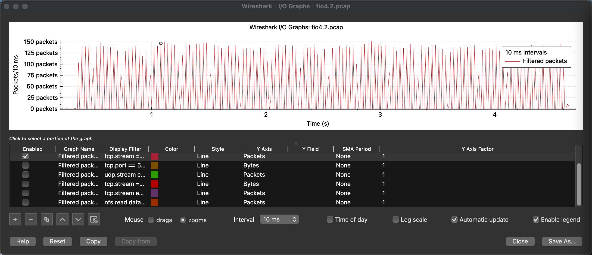

在10ms 为采样周期的角度可以很明显的看到，这个 nfs 的传输在微观的角度看来，是处理一波之后就带宽空闲了。nfs 在当前条件下并没有把带宽用满。

我们可以在抓包的流中找到任何一个延迟较大的两个包来看看，为什么此时不发包了？

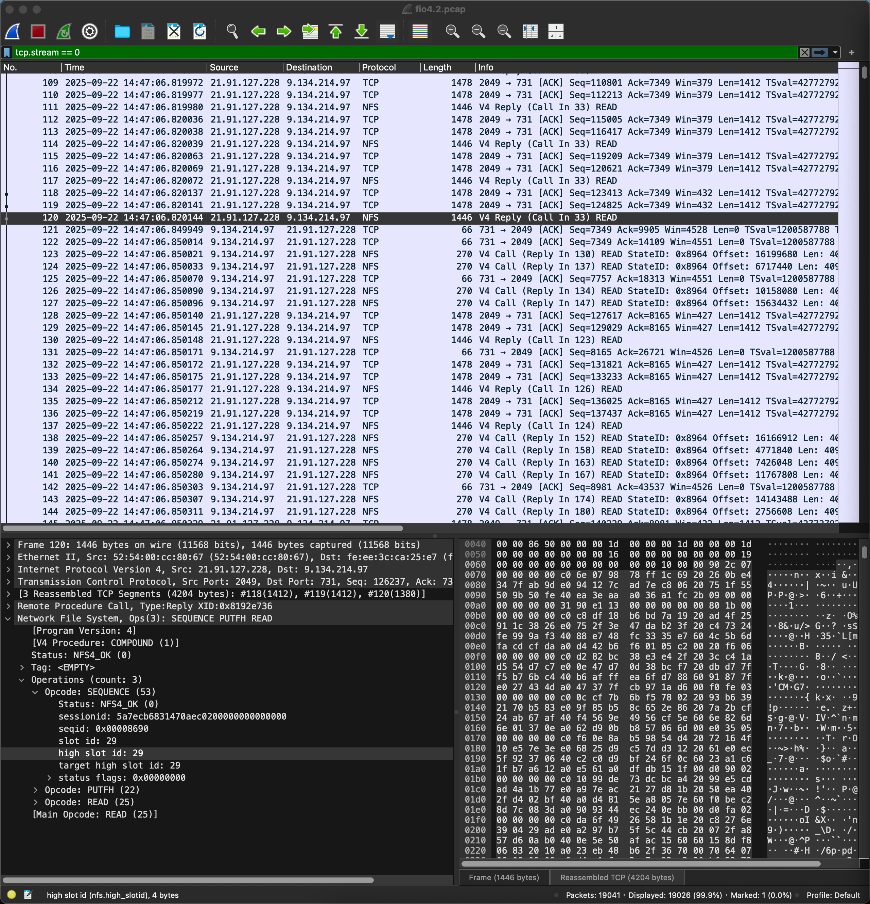

当前是在21.91.127.228的 server 端上抓的包。分析这个120号 NFS 的 READ Reply可以看到，这个包是回应之前 client 发来的 READ 请求的。之后server端在将近30ms 内没有收到包。说明在这个包对应的 READ 请求后，client 端中止了请求的发送。

在回应包中有一个线索，我们可以看到，在 NFS 协议封装的应用行为中，存在3个操作：SEQUENCE、PUTFH、READ。展开SEQUENCE指令，我们可以看到一个 slot id 、 high slot id 以及 target high slot id 这三个值都是29。我们在找这个 Replay 对应的 READ 请求来看看：

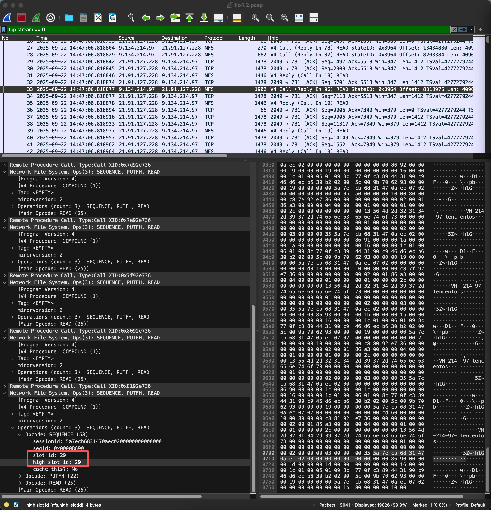

可以看到，这个请求里封装了多了READ 请求。每个都包括了SEQUENCE、PUTFH、READ三个指令。找到最后一个封装的SEQUENCE可以看到，slot id 、 high slot id都到29了。我们可以通过搜索包确认一下，29在整个传输过程里是不是最大的 slot id？

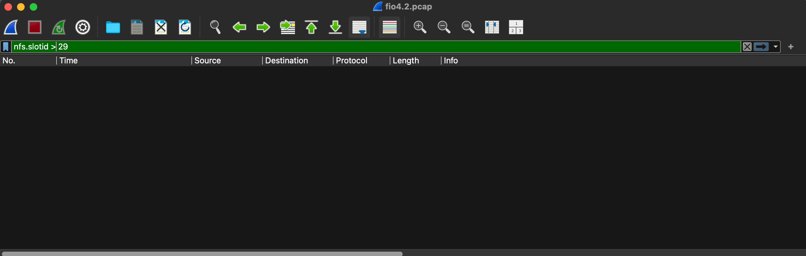

slot id \> 29的为0。

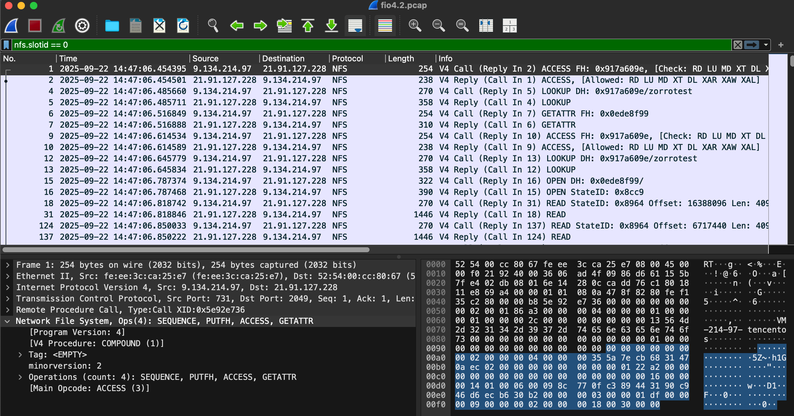

通过观察还能发现，这个 id 是从0开始到29结束。并且仔细观察每一个中断的包，都是 slot id 到达29后还是进入等待。对照一下 NFS 协议的说明[RFC 5661: Network File System (NFS) Version 4 Minor Version 1 Protocol](https://www.rfc-editor.org/rfc/rfc5661#section-2.10.6.1)：

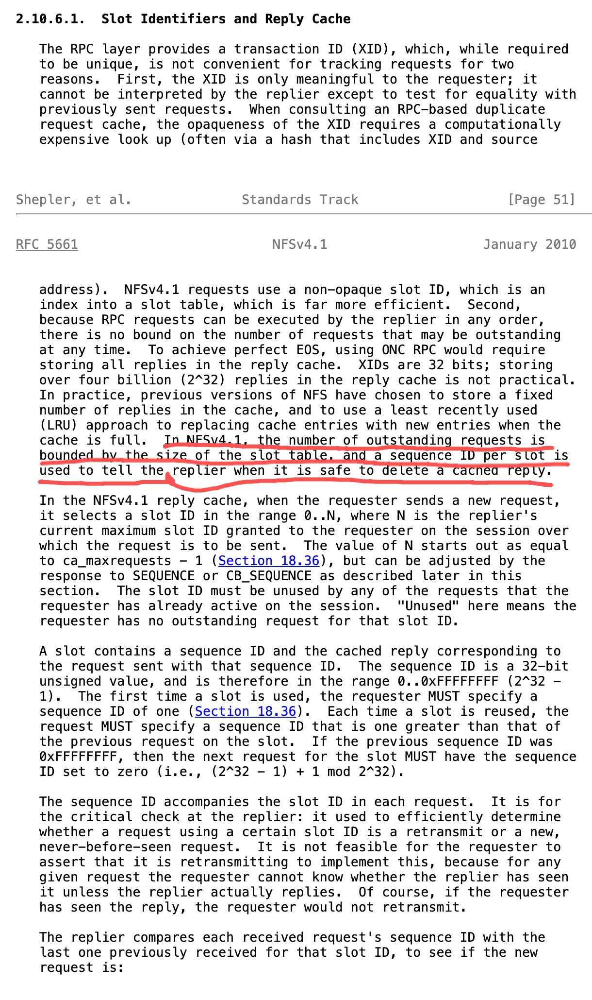

可以确认，这个 slot 就是用来给 NFS 协议处理可以连续发送多少个未完成的 NFS 请求的。就是说：

在 fio 中的 iodepth或者 numjobs 参数触发应用产生的多个未完成请求后，在 NFS 至少4.1版本之后，受到了协议层面 slot id 的个数上限限制。每次最多触发 max slot 个未完成的请求同时发送，并等待回复之后，才能发送下一批请求。这个值在当前内核版本的情况下，最大为29，实际取值范围是0-29，导致我们 fio 测试的时候看到，并发在超过30个后，带宽利用率就不再上升。

出现了如下图所示的带宽利用率瓶颈：

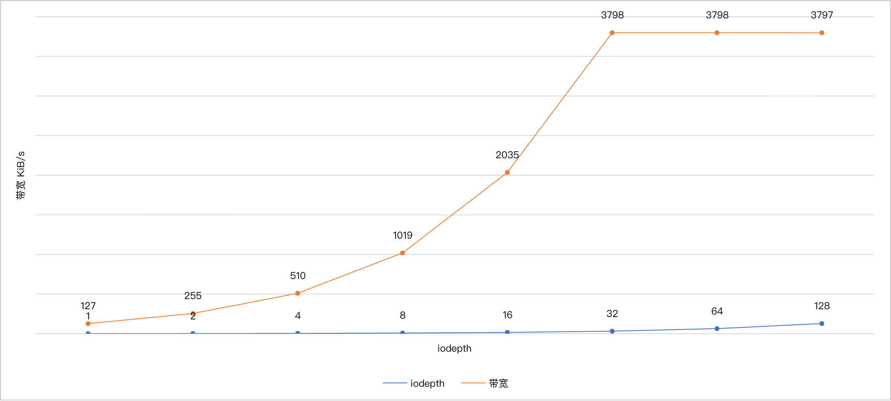

已经明确了 NFS 4.2的瓶颈点，那么优化方案就可以很明确了：

1.  不使用支持slot 之后的 NFS 协议版本。

2.  在支持 slot 的协议版本上找到为什么 slot 上限被设置为30，这个设置是否合理并有优化空间？

我们一个一个来：

#### 使用 NFS 3进行性能测试：

##### 修改协议版本

当前常用的协议版本，除了当前默认的 nfs 4.2外，还有4.0、4.1和3。鉴于从实现层面4.0之后的版本都已经支持slot 这个特性，所以我们可以选择使用 nfs 3重新挂载存储，然后再进行测试，修改 client 端的/etc/fstab：

参数中添加 vers=3，之后重新挂载 nfs：

确认挂载参数中已经有mountvers=3。然后重新测试 fio 性能：

我们以 iodepth=64为例：

可以看到在当前参数下，IO带宽已经达到BW=6864KiB/s，超过了之前的3798KiB/s。说明协议层面应该没有最大 slot id 只能到29的限制了。我们还是使用表格的方式来看看，默认情况下 nfs 3协议的瓶颈点在哪？这次我们直接从 iodepth=16开始：

|  |  |  |  |  |  |  |  |  |
|----|----|----|----|----|----|----|----|----|
| iodepth | 16 | 32 | 64 | 128 | 256 | 512 | 1024 | 2048 |
| 带宽 | 1740KiB/s | 3475KiB/s | 6864KiB/s | 13.5MiB/s | 27.3MiB/s | 54.7MiB/s | 70.2MiB/s | 70.1MiB/s |

我们将带宽的单位都改成 KiB/s，然后再画个图看看：

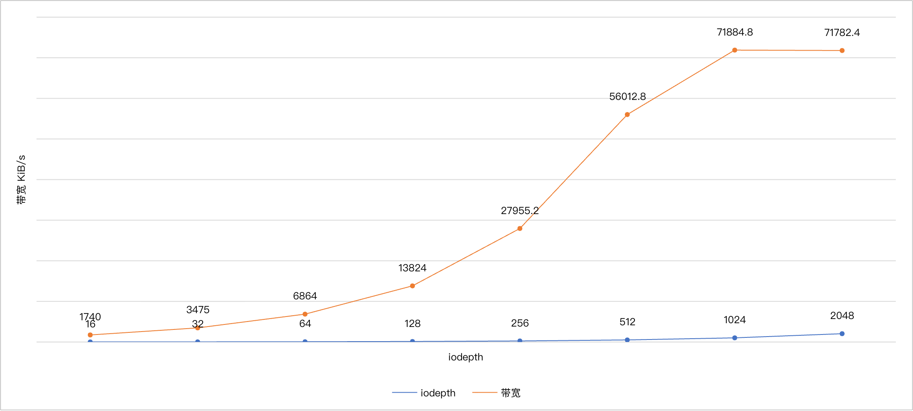

可以看得出来，当 iodepth 达到1024的时候，带宽达到瓶颈。但当前带宽使用只有70多 MiB/s，还未达到我们理想中的带宽，即：150-170MB/s。

这轮测试的过程我们可以注意一下 server 端缓存的影响。在执行测试的时候，会发现，对于一个测试用例来说，第一次压和第二次压的性能是有差异的，这里的第一次压指的是在 server 端清空缓存之后第一次 fio 进行 read。第二次就是之后不清缓存直接使用相同参数进行 fio 压测，我们来观察一下：

server 端执行：

之后 client 端连续执行两次 fio：

在相同的 iodepth 为1024的情况下，可以看到第一次带宽为：36.2MiB/s，第二次为：70.6MiB/s。

可以看到，因为第一次没有缓存的影响，所以读性能更接近服务器上的磁盘性能。一般这个性能是可能高于磁盘性能的，因为我们在 client 上是随机写，这些随机写请求传导 server 端后，是由 nfsd 内核线程进行处理的，在处理过程中，因为并发请求较多，很可能将部分随机写请求合并成顺序写下发给磁盘。出现 client 端看到的性能实际可能大于 server 端磁盘性能的现象。这里我们不去深究。目前的问题依然是，在有 server 端缓存的情况下，为什么 nfs 3的传输依然无法达到带宽上限？

### NFS 3瓶颈分析：

我们继续采用抓包的方式进行分析，还是先看一下流量状态：

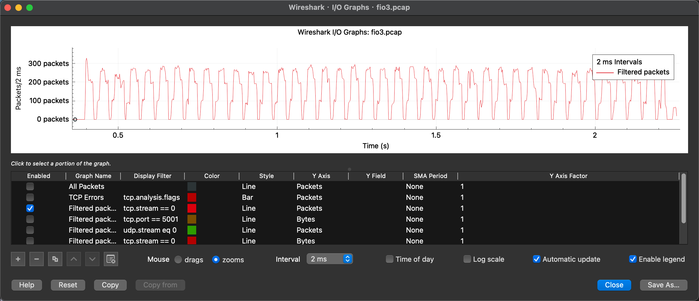

2ms 的间隔来看，带宽仍有空隙，说明 tcp 协议层面的带宽仍然没有用满。

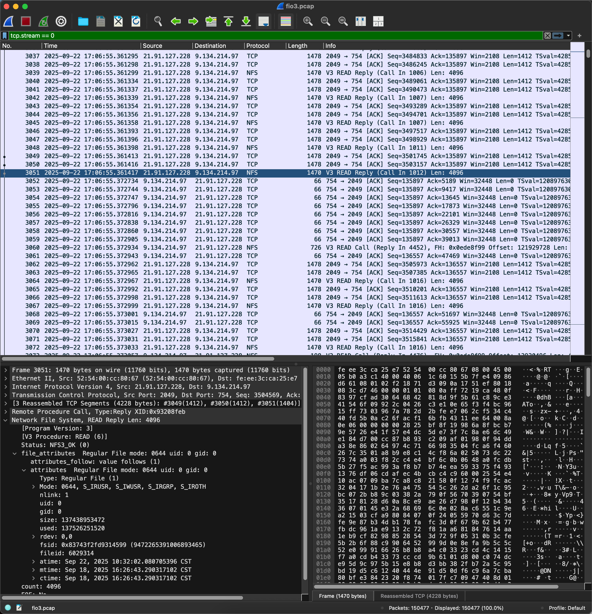

tcp 流中能看到，连续发送包之后，会有近11ms 的延迟后，才收到之前回包。多看几个延迟会发现另一个现象，就是每次延迟的时间在缩短：

第一次间隔将近30ms：

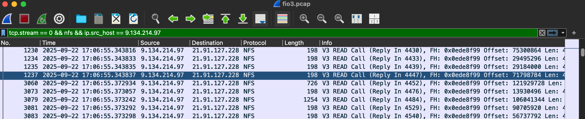

第二次间隔20ms：

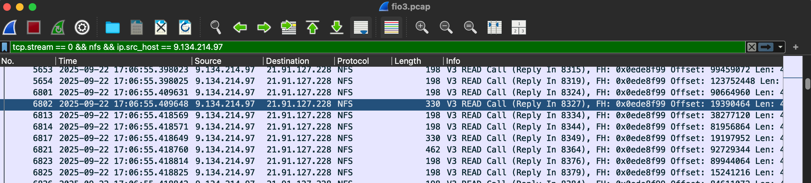

第三次间隔不到20ms：

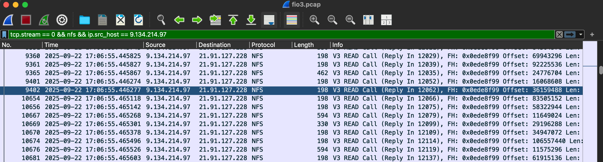

呈现间隔时间不短缩短的状态，放大前几次的流量状态也能看到这个状态：

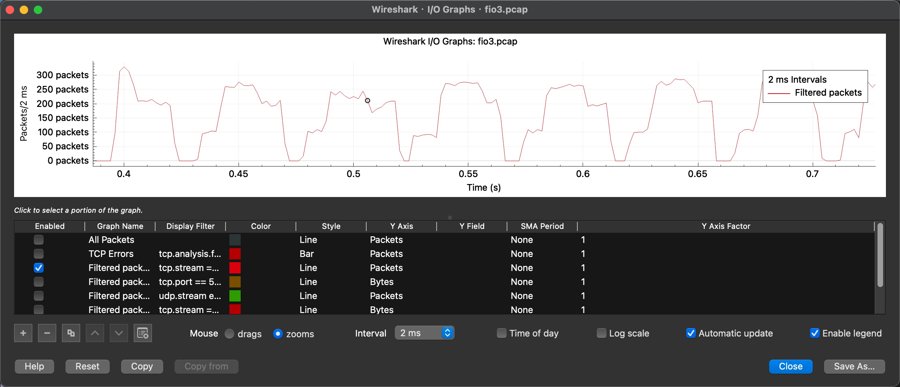

##### 增大 TCP 读写缓存

基本可以确定这个带宽利用率低是因为 TCP 慢启动导致的。调整server 和 client 的 tcp 读写缓存：

server 端：

client 端：

再进行测试并抓包看流量状态：

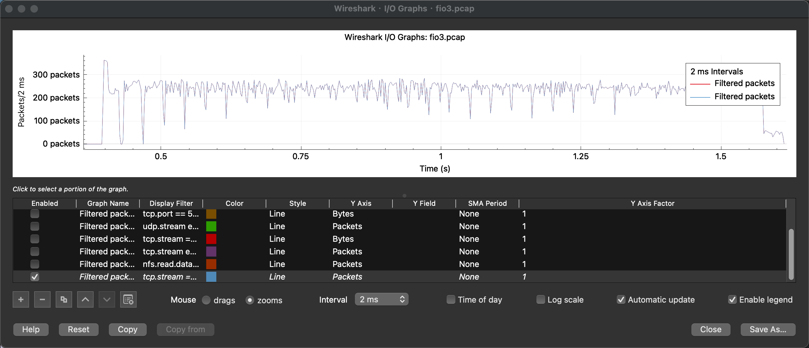

当前来看，带宽已经达到102MiB/s，流量图也没有很明显的带宽利用率低的现象了。

但是依然没有达到理论上的150-170MB/s。

不过目前的瓶颈很明确，是当前网络环境单 TCP 通道已经达到上限。我们可以使用 iperf 的单连接方式验证一下数据：

所以很明显，想要再增加带宽，需要 nfs 支持 tcp 协议层面的多并发连接进行传输，就像多并发的 iperf3 一样：

1.52Gbit/sec 换算成字节大概是190M/s，这是网络的理论上限。

##### 增加 nfs 的并发连接数

幸运的是，当前的 nfs 已经可以通过 client 端挂载参数的方式支持多并发连接，可以参考 man 5 nfs 中的 nconnect 参数的说明：

最大值不超过16，在我们当前的场景下足够用了，我们先改成4试一下：

fio测试：

此时，在 iodepth=2048的情况下，nfs 的 IO 带宽已经跑到183MiB/s了。达到我们预期的带宽理论上限。

小结一下，目前我们通过一系列的优化，已经让应用在4k的块大小以及网络延迟在40ms左右的条件下，让 nfs 存储在随机读的情况下达到理论带宽的限制，主要的优化手段包括：

1.  应用层面要增加并发 IO 个数。在 fio 中，我们采用 libaio engine 的 iodepth 参数或 numjobs 来实现这个条件。

2.  nfs 使用 version 3。以避免高版本 nfs 协议中，max slot id 相关实现的并发请求处理能里限制。高版本nfs 4.2的优化我们等下再分析。

3.  tcp 要增大server 和 cleint 端的读写缓存。减少 tcp 慢启动对带宽利用率的影响。

4.  nfs client 要以多个 tcp 并发连接方式挂载。在mount 参数中使用 nconnect 指定并发个数。

nfs3是一个比较旧的协议版本，虽然它在协议层面并不限制应用提交的并发请求个数，相比新版本协议在特定的应用场景下有一定性能优化，但是它的缺陷也是显而易见的。相比 NFSv3，NFSv4.2 的改进是全方位的，核心价值体现在：

1.  更安全：原生加密、细粒度 ACL、Kerberos 认证，满足企业合规需求；

2.  更高性能：COMPOUND 操作、pNFS、大文件支持，适配高并发 / 大存储场景；

3.  更易用：单一端口、跨平台兼容、平滑迁移，降低运维成本；

4.  更灵活：克隆、Reflink、空间回收等功能，适配云 / 容器 / 超融合等现代架构。

所以进一步提升 nfs4.2在当前这个应用场景下的性能，也是很有必要的。下面我们就来进一步分析一下：

### 为什么 NFS4.2并发性能差？

这个问题的表面原因我们在之前已经分析过了：NFS4.2在协议层面的SEQUENCE指令中，实现了一个 slot 的概念，用来承载未完成的并发请求。我们在之前侧测试中看到，在一个默认的 nfs 连接中，这个 slot id 最大不能超过29，id 取值范围是0-29，所以协议层面最大未完成的并发 IO 数最多只有30个，这严重影响了应用的性能，尤其在网络延迟比较大的场景中。

但是这个最大的 slot id 是怎么来的呢？我们要进一步从 nfs 协议层面进行深入分析一下。整个传输过程中，max slot id 都不会超过29，从协议层面分析，这个值应该是在 nfs 最初 mount 的时候，client 端和 server 端协商出来的。所以我们抓一下 mount 时的连接建立过程来看看协议协商的过程：

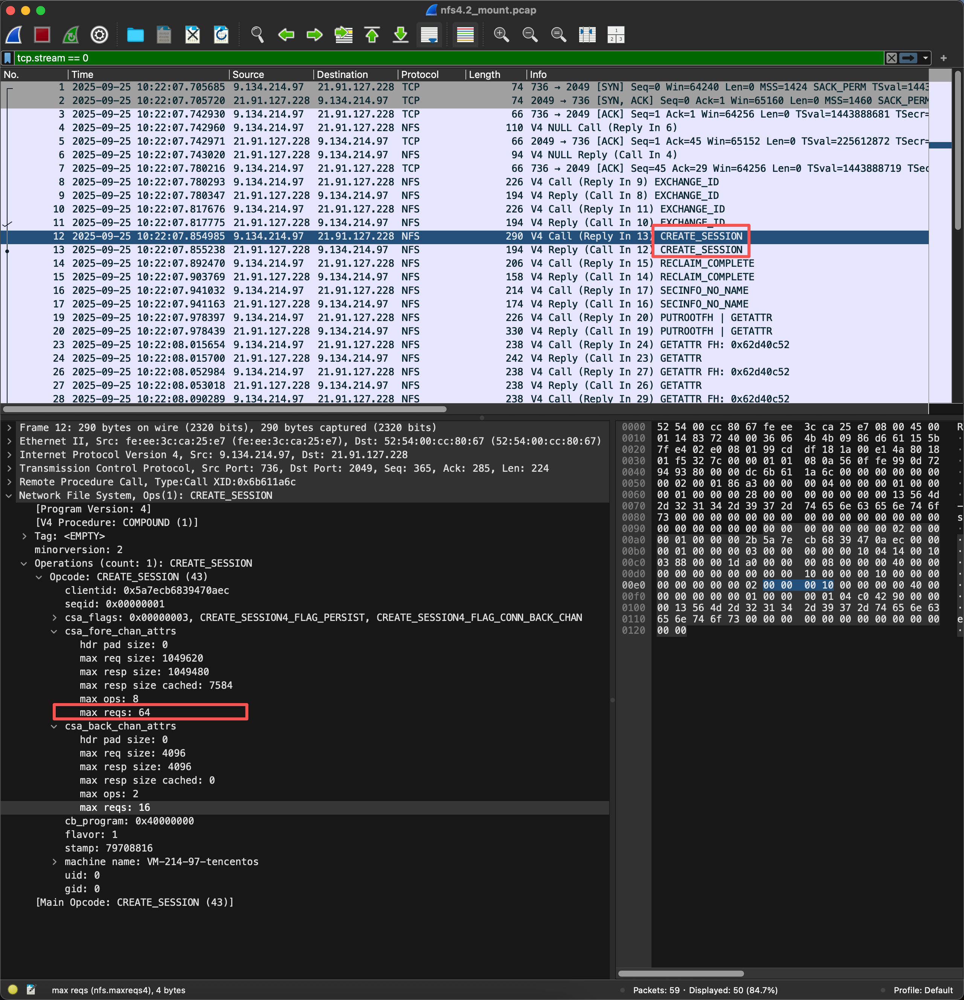

抓包过程我们可以很清楚的看到，nfs4.2在创建连接的过程中会使用 CREATE_SESSION命令创建 session，这个命令由一组 Call 和 Replay 组成。client 端在 Call 中，将自己这端可以支持的 max reqs 发送给对端。对端也会将自己能支持的max reqs 通过 Replay 发送给 clien 端。两边协商后，使用最小的 max reqs 创建 slot id 个数：

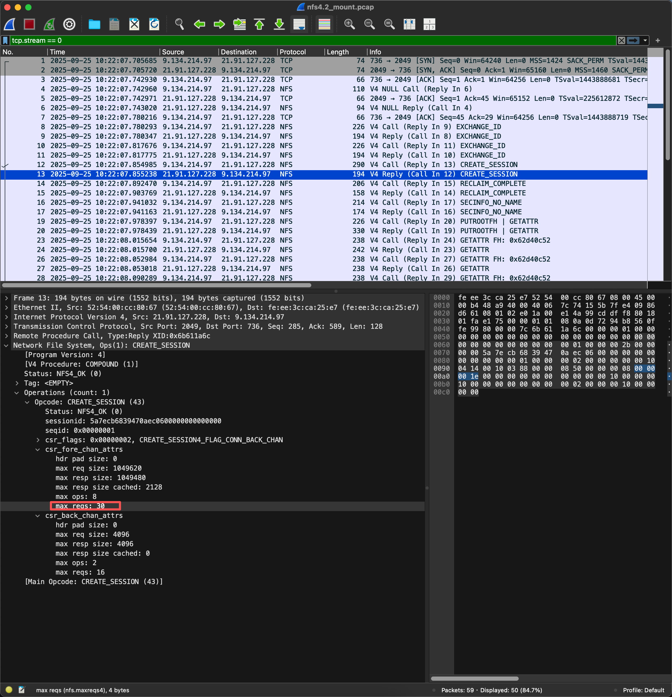

在当前的条件下，我们发现虽然 client 端发送的 max reqs 可以支持到最大64，但是 server 端只回复了30。这导致了在后续的连接处理过程中，最大的 max slot id 只能到29。从而成为了 IO 传输过程中未处理请求的最大个数瓶颈。

当然到目前为止，这只是猜测。我们还需要从内核代码中验证一下这个交互过程。以及为什么 server 最大只能回复 max reqs 为30。先来看看 client 端的代码，我们先来找到 client发送 channel 初始化的相关函数：

可以看到，client 初始化fc_attrs.max_reqs的值为max_session_slots，而max_session_slots在这之前会进行初始化：

首先在fs/nfs/super.c中，这个值会被初始化成默认值：

头文件中这个值设置默认为64。我们再来看看这个值在生效前会不会有其他变化.在相关定义中，这个值也可以通过 nfs 的 module 参数传入：

在nfs4_verify_fore_channel_attrs中，client 最终会通过 server 端回复的 max_reqs来决定最终生效的值，可以看到选择的是两端的最小值。并且不能超过上限NFS4_MAX_SLOT_TABLE，这个值在当前内核版本定义为1024:

我们来看一下通过nfs 的模块给 nfs 传入 max reqs 的方法，通过systool命令可以查看一个模块支持的参数：

可以看到默认max_session_slots的值也是64。nfs client通过调整这个参数可以支持应用发送更多的未完成 IO 请求。但是最终生效的值，我们还要来看看 server 端的实现：

核心处理过程在check_forechannel_attrs中，最终生效的maxreqs，判断是否超过#define NFSD_MAX_SLOTS_PER_SESSION 160的限制。然后使用nfsd4_get_drc_mem算出最终生效的maxreqs。

这里要注意的是：

1.  check_forechannel_attrs本身就是被nfsd4_create_session函数调用的，所以这里第一个maxreqs就是 client 端传过来的值。

2.  nfsd4_get_drc_mem会根据当前系统相关资源状态算出最终的 server 端决定的 maxreqs 值，代码如下：

我们不再这里对这个函数多做解释，简单一句话，就是通过当前 server 端的drc内存资源状态，来算出最终的 maxreqs。这个值在在之前的测试场景中最终算出来为30。之后通过：

初始化可以使用的最大 slot 资源。从0-29的 slot 就是在这里初始化的。

综上，我们确定 client 端目前可以支持的最大 maxreqs 上限为1024，default 值为64。

server 端可以支持的最大 maxreqs 为160，default 值使用nfsd4_get_drc_mem做运算，在正常场景下这个值返回为30。

这就最代码逻辑上确定了最终决定 nfs4.2的瓶颈在 nfsd server 端。在当前场景下，单独增加 client 端的相关配置并不会提升性能，nfsd 侧也没有方便的可调整参数来影响最后生成的 slot 个数。在当前内核版本的代码中，想要进一步提升 nfs 4.2的性能，只能通过给代码打补丁的方式进行调整。

### 提升 NFS4.2的性能：

##### 内核代码性能优化

我们当前内核版本为6.6.47-12.tl4.x86_64，我们可以先看看社区中针对这么明显的性能 bug 是否已经有性能提升的 patch？

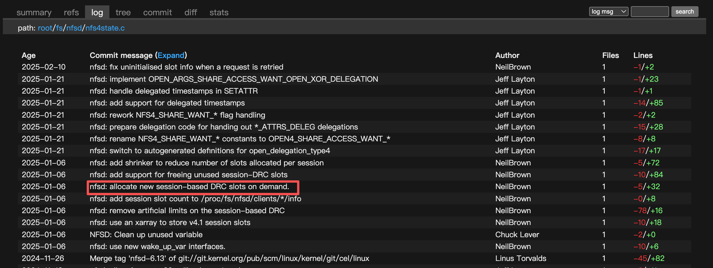

在2025年1月的相关修复中，我们倒是很快就能找到相关关键字的 patch 信息。

patch 地址：[nfsd: remove artificial limits on the session-based DRC - kernel/git/torvalds/linux.git - Linux kernel source tree](https://git.kernel.org/pub/scm/linux/kernel/git/torvalds/linux.git/commit/fs/nfsd/nfs4state.c?id=b5fba969a2e445e2f36b699582d8410478a99374)

代码我们就不具体分析了，看一下注释：

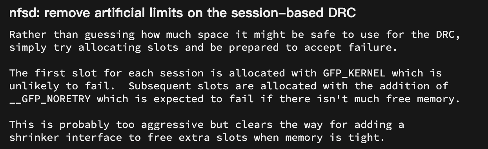

就是不搞保守的根据当前资源计算的分配策略了，就直接按照当前配置的个数分配就行了。那么现在分配了多少个数呢？在另一个 patch 里有对之前的配置有改变：

[nfsd: use an xarray to store v4.1 session slots - kernel/git/torvalds/linux.git - Linux kernel source tree](https://git.kernel.org/pub/scm/linux/kernel/git/torvalds/linux.git/commit/fs/nfsd/state.h?id=0b6e14242630ad5f65839b23400bd67c5166e2b4)

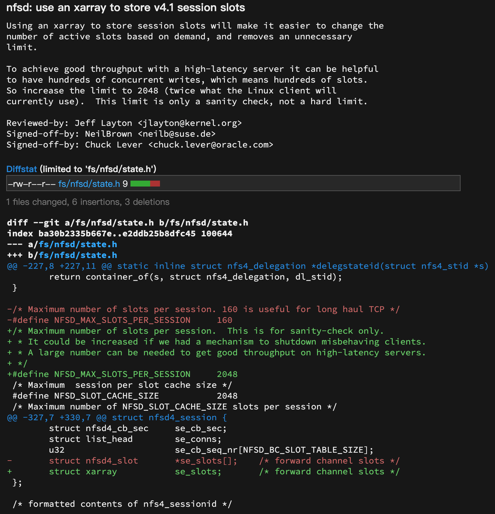

直接#define NFSD_MAX_SLOTS_PER_SESSION 2048，这下通畅了。另外增加了在 nfs 传输过程中动态增大 slots 个数的策略：

[nfsd: allocate new session-based DRC slots on demand. - kernel/git/torvalds/linux.git - Linux kernel source tree](https://git.kernel.org/pub/scm/linux/kernel/git/torvalds/linux.git/commit/fs/nfsd/nfs4state.c?id=60aa6564317db29ea72b6db821b5bbb45f1e879d)

在nfsd4_sequence的处理过程中直接增加了：

这段代码的意思就是，如果在交互过程中发现 max slot id经常被占满，则在当前的 max slot id 上增加20%的个数。就是说，只要传输的够久，那么理论上当前的 max slot 个数是可以一直涨到NFSD_MAX_SLOTS_PER_SESSION上限的。不过在这之前，会受到 client端的上限限制，即：NFS4_MAX_SLOT_TABLE = 1024的限制。

至此，我们就找到了 NFS4.2的性能优化方案了。server 端安装一个6.14版本以上的内核就可以了。我们来试一下：

server 端切换6.14，然后客户端使用默认 mount 参数挂载：

当前性能：

BW=61.3MiB/s，当前瓶颈应该是 nconnect，提升之后性能应该会有提升：

BW=100MiB/s。我们对照之前的 nfs 3版本的性能测试预期，在 iodepth=2048的情况下，IO 带宽是能突破150M 的。此时瓶颈应该已经在 client 端的 max reqs 限制上了，目前最高是1024。在更新版本的内核上，我们看到#define NFS4_MAX_SLOT_TABLE (1024U)的定义也并没有变化。这里如果要突破这个限制，可以通过改 nfs client 端内核代码的方式实现，将NFS4_MAX_SLOT_TABLE调高。我们修改后重新编译内核试一下：

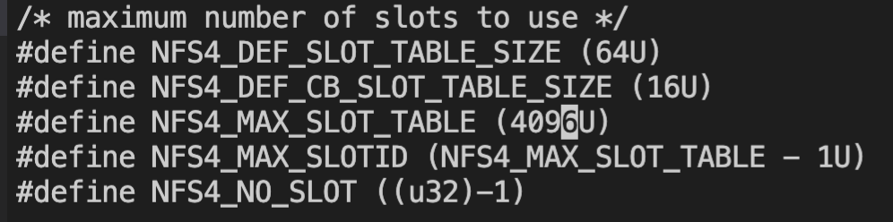

我们暂时将它调整4096：

BW=186MiB/s，已经达到带宽限制的理论上限。我们再通过改变 iodepth 的方式来看看在各个配置下的性能数据：

|  |  |  |  |  |  |  |  |  |
|----|----|----|----|----|----|----|----|----|
| iodepth | 32 | 64 | 128 | 256 | 512 | 1024 | 2048 | 4096 |
| 带宽 | 3566KiB/s | 7110KiB/s | 14.5MB/s | 27.4MiB/s | 53.6MiB/s | 102MiB/s | 186MiB/s | 188MiB/s |

已经可以跟 NFS3协议版本相比了。至此，我们已经通过升级 nfsd 的内核代码，以及修改 nfs client 端内核中最大 max reqs 限制的方式，完成了针对 nfs 4以上版本协议的优化。

## 小结：

小结一下，我们通过以下5个手段，让 NFS4.2版本的服务，达到了 NFS3的性能，并在延迟为40ms、带宽为1.5Gbit/s的网络环境上，让应用的随机读操作在4k 块大小的条件下达到了带宽上限：

1.  应用加大并发 IO 数量：对于 fio 来说，就是通过增加 iodepth 或者 numjobs 的方式来完成。

2.  修改协议版本：在旧版本内核上，nfs 4以上的协议版本有明显的并发性能处理瓶颈，可以简单的通过使用 NFS v3的方式来提升性能。

3.  增大 TCP 读写缓存：在大延迟网络的情况下，TCP 缓存的大小会影响慢启动的效率，增大 TCP 缓存可以明显提升网络吞吐量。

4.  增加 nfs 的并发连接数量：使用 nconnect 参数来增加 tcp 的并发连接数量，以避免单通道 tcp 本身成为带宽瓶颈。

5.  内核代码性能优化：通过优化 nfs 服务端和客户端的 max reqs 对协议中 slot 最大数量的限制，让 NFS V4以上的协议达到了理想的性能。

至此，我们对 fio 在 nfs 存储上的随机读性能差的这只麻雀就解刨完了。

# NFS 的写性能：

下面我们接着来分析第二只麻雀，nfs 的写性能。

## 随机写：

我们先来考察一下随机写，按照之前的方法，我们需要先评估一下 server 端磁盘自身的写能力，测试用例：

改变 iodepth 看看相关性能：

|  |  |  |  |  |  |  |  |  |
|----|----|----|----|----|----|----|----|----|
| iodepth | 1 | 2 | 4 | 8 | 16 | 32 | 64 | 128 |
| 带宽 | 6380KiB/s | 12.4MiB/s | 24.9MiB/s | 23.7MiB/s | 24.7MiB/s | 24.7MiB/s | 24.7MiB/s | 24.7MiB/s |

我们发现当 iodepth 超过4之后，性能就不再提升了。4k 随机写性能基本稳定在25MiB/s 左右。之后我们在 nfs client 上通过 nfs 服务进行压测：

测试用例：

|  |  |  |  |  |  |  |  |  |
|----|----|----|----|----|----|----|----|----|
| iodepth | 1 | 2 | 4 | 8 | 16 | 32 | 64 | 128 |
| 带宽 | 105KiB/s | 211KiB/s | 424KiB/s | 847KiB/s | 1693KiB/s | 3159KiB/s | 3153KiB/s | 3231kB/s |

可以看到在旧版本内核环境下，瓶颈依然在30左右。所以优化方案仍然是按照之前的思路，先改 NFS3试一下：

修改之后我们直接从32之后开始：

|  |  |  |  |  |  |  |  |  |
|----|----|----|----|----|----|----|----|----|
| iodepth | 32 | 64 | 128 | 256 | 512 | 1024 | 2048 | 4096 |
| 带宽 | 3458KiB/s | 6685KiB/s | 13.2MiB/s | 17.3MiB/s | 17.2MiB/s | 17.1MiB/s | 18.4MiB/s | 18.3MiB/s |

我们发现当 iodepth 达到256之后，性能增长就有限了。但仍然没到理论上限25MiB/s。我们可以分析一下目前可能的瓶颈在哪里？

从 IO 模型上分析，当使用 fio 直接在 server 端进行压测的时候，IO 请求是直接提交给块设备的。此时我们使用 iodepth 指定的并发请求也会同时发给设备，这样可以获取最大的性能。

但使用 nfs client 进行压测时，请求都要通过网络传输过来，虽然我们指定了 nconnect=4，TCP 层面有多通道。但是 IO 请求到了 server 端后，还要由 nfsd 这个 server 端的内核进程提交给块设备。nfsd 这个进程如何提交进程，就成了当前的性能瓶颈。因为 nfs本身是存储服务，所以nfsd 进程默认都要等待它所代理的每一个 io 请求都返回，才会发送下一个 io。所以 nfsd 默认是不能直接代理翻译 fio 的 iodepth 这个参数的行为的。另一方面，nfsd 考虑了代理请求的并发性能问题，所以它并不是只开启一个内核 nfsd 线程来处理请求的，默认会开启8个。可以通过以下参数调整：

我们将线程数调高看看性能会不会有提升：

此时测试数据在 iodepth 达到256之后，已经基本可以获得贴近磁盘性能的 IO 能力：

|  |  |  |  |  |  |  |  |  |
|----|----|----|----|----|----|----|----|----|
| iodepth | 32 | 64 | 128 | 256 | 512 | 1024 | 2048 | 4096 |
| 带宽 | 3660KiB/s | 7272KiB/s | 14.1MiB/s | 22.9MiB/s | 23.8MiB/s | 23.7MiB/s | 23.9MiB/s | 24.0MiB/s |

## 

## 顺序写:

在使用 client 对 nfs 进行随机写压测的条件下，nfs 的网络传输并不能实际改变随机写本身的特性。对于我们的测试用例来说，无非是从单进程的多 io 并发，变成了 server 端的多个 nfsd 线程的单 io 并发。所以，当nfs 协议本身并不存在并发性能瓶颈的情况下，我们是可以很容易通过增加 nfsd 线程个数来达到磁盘写性能上限的。

但是顺序写的影响会比较大，我们先来看看在 server 端本地使用顺序写可以获得的性能：

在 iodepth=2048的情况下BW=167MiB/s，是可以达到 cbs 的磁盘写性能上限的。这主要的原因是，当使用顺序写且高 io 并发的情况下，实际上并发出来的 io 都是按顺序发送的，这样就可以在内核的 block 层进行合并。实际上提交给硬盘的 io 请求的 block，是要比4k 更大的。我们可以观察一下 iostat 的输出来看看这个特征：

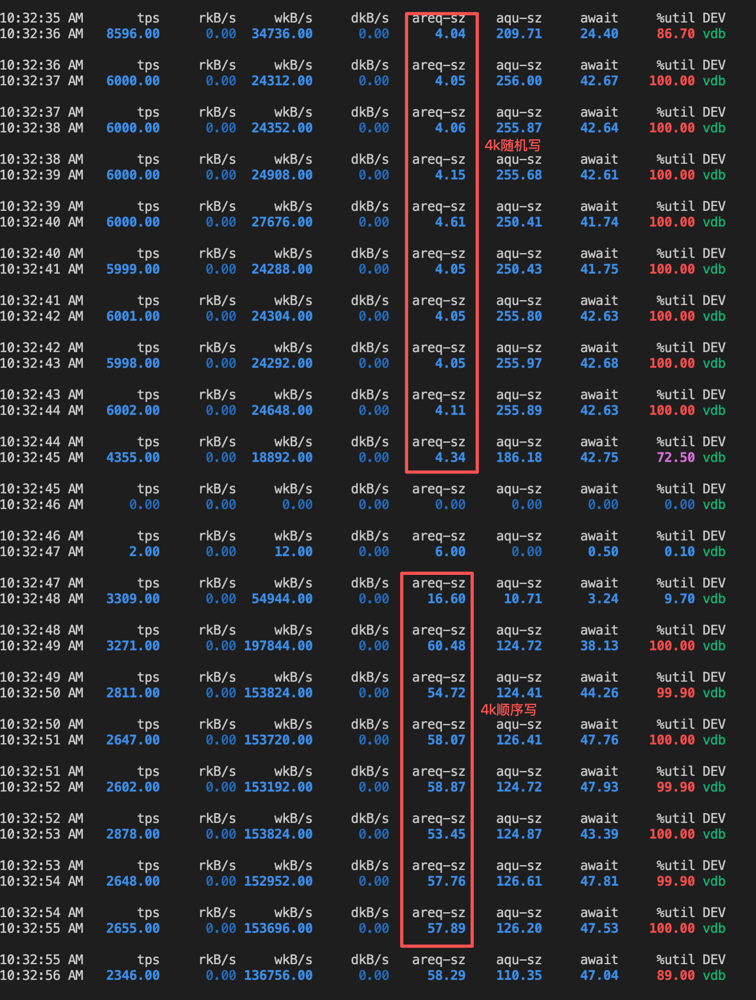

上图分两部分，第一部分是4k 随机写时的信息，下半部分是4k 顺序写。可以很明显的看到，areq-sz 即平均请求大小，在4k 顺序写的情况下要远大于4k。平均可以达到近60k。这就导致在本地写的情况下，顺序写可以获得远大于随机写的性能。

但是经过 nfs 之后，顺序写的行为会产生变化。并发的每个请求会通过网络传输后，提交给多个 nfsd 线程进行轮训处理，所以顺序写在 nfs server 端实并不能在内核 block 层产生高效的合并。顺序写的行为实际变成了随机写。我们来看看 nfs 的顺序写性能和 iostat 状态：

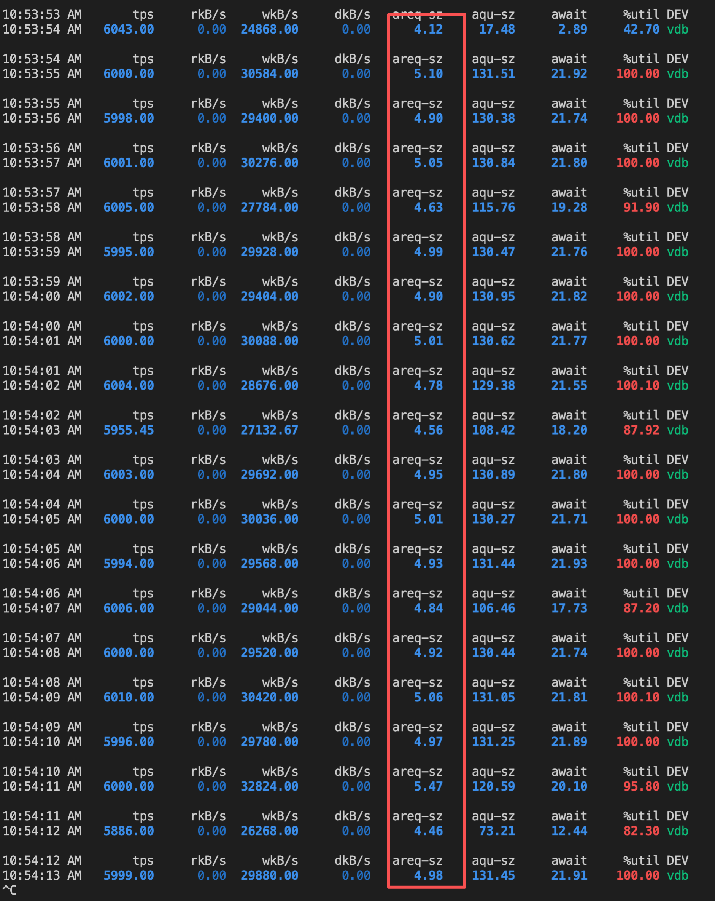

可以看到 areq-sz 基本和本地随机写差不多。所以也无法获得更好的性能。BW=28.9MiB/s，比本地随机稍高一点。从 io模型的角度来推理可以明白，此时如果调整 nfsd 的线程个数，会对 IO 性能产生一定影响，server 端的 nfsd 线程个数越多，相当于并发写 IO 的线程越多，那么从顺序 IO 的角度讲，此时block 层遇到相邻 io 的几率更高，那么就能产生更多的合并从而获得更好的性能。但这只是提升了概率，IO 性能提升效果应该不会很明显。大家可以自己构造环境测试一下能提升多少。

## NFS 写缓存

无论顺序写还是随机写，想要获得更明显的性能提升的方法其实是开启写缓存。默认情况下，nfsd 提交 io 请求都是以 sync 方式处理的，为了数据确定写入硬盘，会等到写操作返回才结束。如果可以开启写缓存，即让 nfsd 以 async 方式进行处理的话，那就可以大大提升写性能。但是性能提升的同时，会引入数据风险。此时因为 nfsd 写数据先写到缓存里，存在一定时间内不落盘的风险，此时如果 server 端断电，则可能造成数据丢失或者数据不一致。使用者要平衡这种性能的提升和风险的提升，如果对数据丢失不敏感的业务，则可以考虑加async 参数提升写性能。我们来看看能提升多少：

server端：

client 端：

此时随机写带宽BW=187MiB/s，达到网络速度上限。我们可以不用测试顺序写了，性能应该跟这个类似。

## 小结：

NFS 的写性能提升主要思路跟读性能的提升思路实际上是一致的。差别在于以下几点：

1.  随机写要注意 nfs4.2版本协议的性能瓶颈，在跟读一样，在6.14之后的内核版本中，nfs4.2并发性能有提升。我们在当前环境下使用了 nfs3进行性能提升。

2.  写操作的情况下，server 端的 nfsd 线程个数对写操作的性能更敏感。此时提升 nfsd 线程个数可以获得更好的性能表现。

3.  打开 server 端的写缓存，即 async，可以大大提升写性能。但会引入数据丢失的风险，要谨慎评估使用。

# NFS 目录遍历性能：

第三只麻雀就是在 nfs 文件系统上对目录执行 ls -l。我们主要分析的是 ls -l，而不是 ls。这两个命令虽然只差一个参数，但底层行为差距很大。ls 只需要读到当前目录的目录项中的信息，文件名和目录名都放在当前目录的目录项中，所以只需要很少的系统调用既可以完成。而 ls -l 需要遍历当前目录下所有文件的 stat 信息，所以需要的系统调用次数更多，在 nfs 环境下ls -l 类操作造成的性能瓶颈也经常出现。

## 性能瓶颈分析：

我们在当前环境下创建一个包含100个空文件的目录，对比一下对这个目录进行 ls 和 ls -l 的耗时差别：

我们还是先来看一下这个命令在当前环境下的执行时间：

可以看到，ls 执行只需要不到0.3秒，而 ls -l 需要9秒多。我们可以分别抓包对比观察一下两个命令在网络层面的交互过程：

ls：

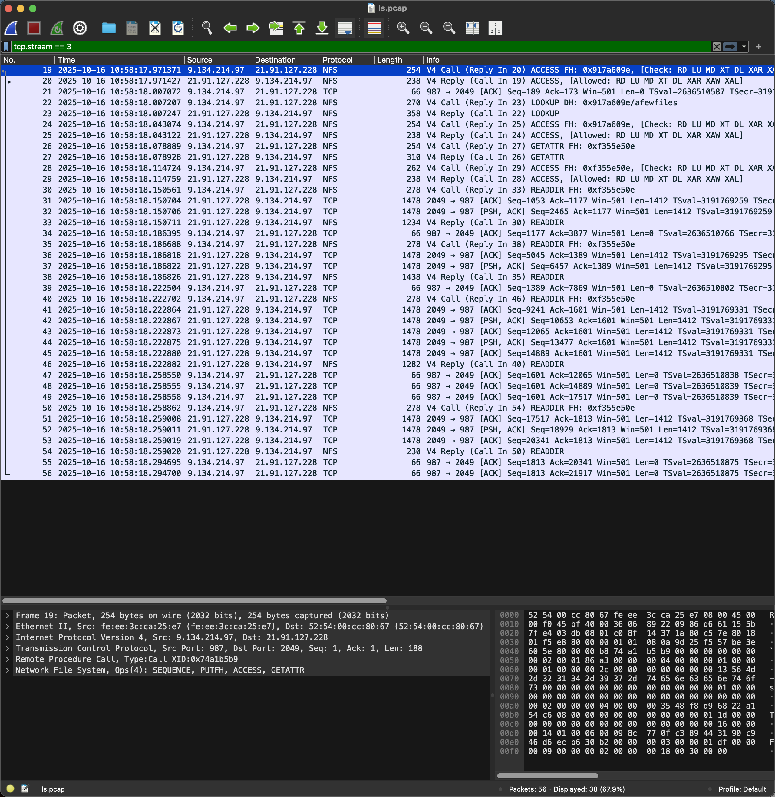

ls -l：

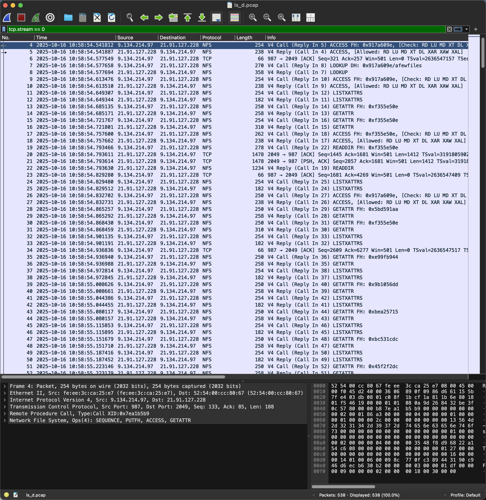

可以看到 ls 整个交互过程只需要56个包的传输。而 ls -l 需要538个包的传输。因为我们环境的网络延迟比较大，每次交互都要40ms，累积起来整个 ls -l 的时间就很长。这个区别也是我们刚才说的，ls 只需要查看一个目录的目录项，而 ls -l 因为要展示所有文件的属性信息，所以还要遍历所有文件。整个过程造成了延迟大大增加。但是我们注意到，整个目录有100个文件，在网络延迟40ms 的情况下，每个文件都取一遍属性信息的理论执行时间应该是4秒多（100 \* 40ms）。而现在的执行时间达到9秒多，明显比理论时间多了不少。

从抓包的交互过程分析，我们也很容易发现，针对每个文件取属性信息的过程包括了两个交互，一个是 LISTXATTRS，一个是 GETATTR。这样造成了针对每个文件都有两个网络的交互，造成了延迟增加了一倍。那么协议层面有这个必要么？还是来看看 RFC 中对这两个指令的定义：

LISTXATTRS定义在 nfs v4的拓展属性相关 RFC 中，[RFC 8276: File System Extended Attributes in NFSv4](https://www.rfc-editor.org/rfc/rfc8276.html)。这其实就是 nfs 协议针对各种操作系统或文件系统的文件拓展属性的支持框架。比如在 Linux 环境上，开启了 SELinux 的文件都会标记相关的安全上下文。在相关文件系统中的支持是在拓展属性中标记的。

从 nfs 的角度来说，要支持这些拓展属性，无论什么属性，肯定都要先查询当前文件都有哪些拓展属性。所以从 LISTXATTRS的定义层面看，LISTXATTRS 指令是用来从当前文件句柄指定的文件系统对象中检索可变数量的扩展属性，同时提供相关信息，以便客户端能够在后续的 LISTXATTRS 请求中获取更多的属性。

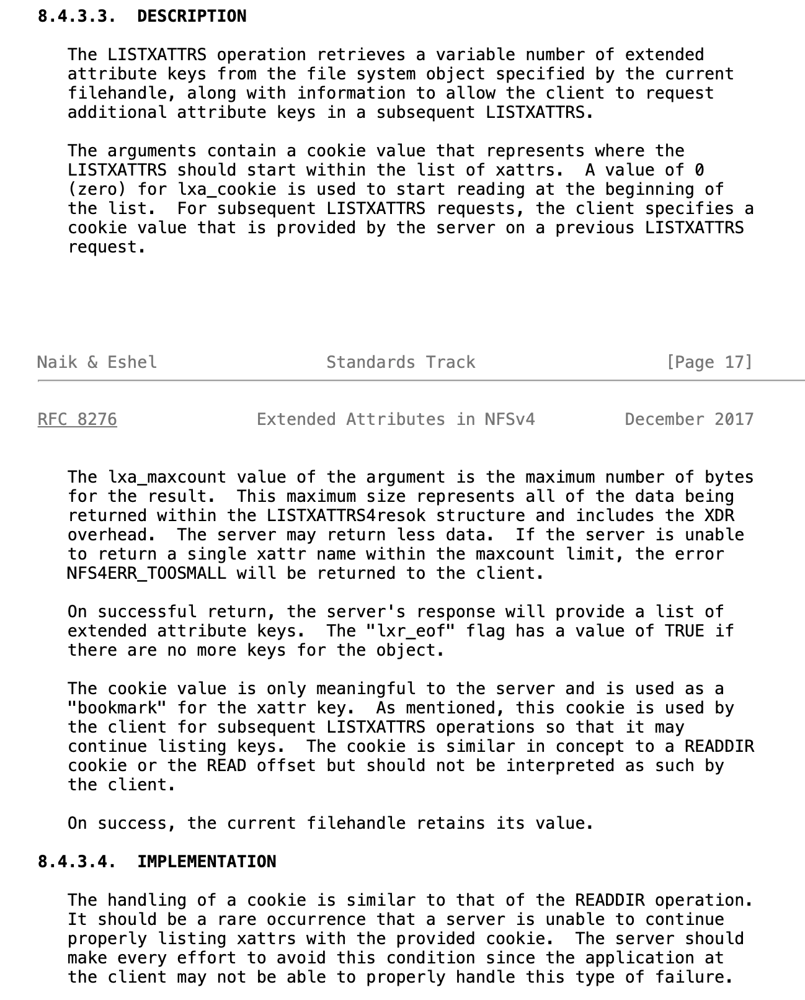

RFC 中的协议相关行为描述的比较完整，这里不多赘述。但仔细观察我们当前的 LISTXATTRS 的反馈信息可以看到：

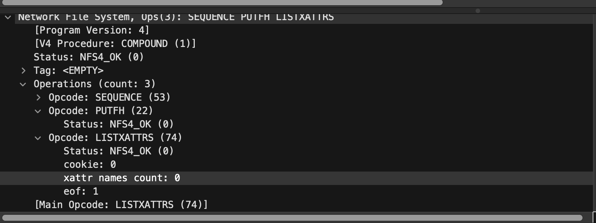

实际上我们当前环境是没有支持任何 xattr 拓展属性的，目前大多数服务器的 SELinux 都是关闭的，这个交互实际上完全没有必要。既然这个功能是 nfs v4后引入的，那么我们自然也可以通过使用 nfs v3的方式进行优化。

另一个 GETATTR 指令是一个比较传统的指令，很早的协议版本就支持了：

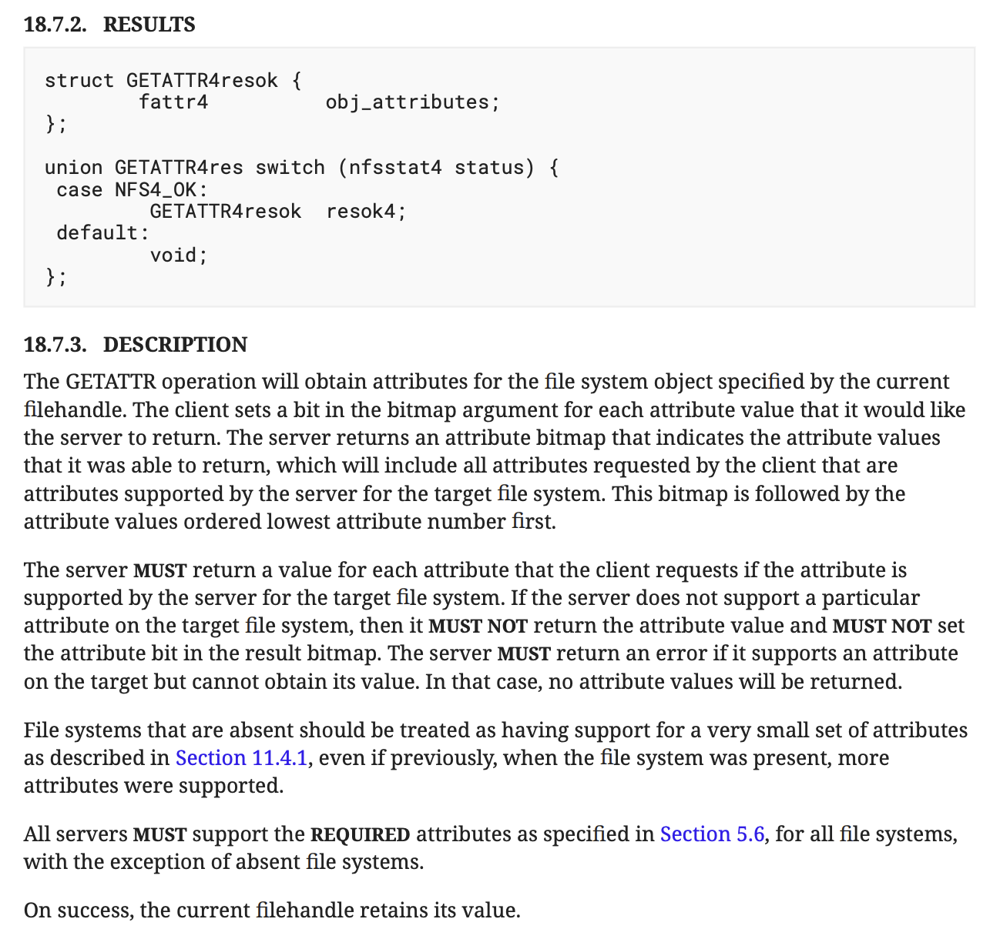

这个指令比较简单并且必要，是用来查看每个文件基础属性信息的。比如文件所属用户、所属组、读写权限等信息：

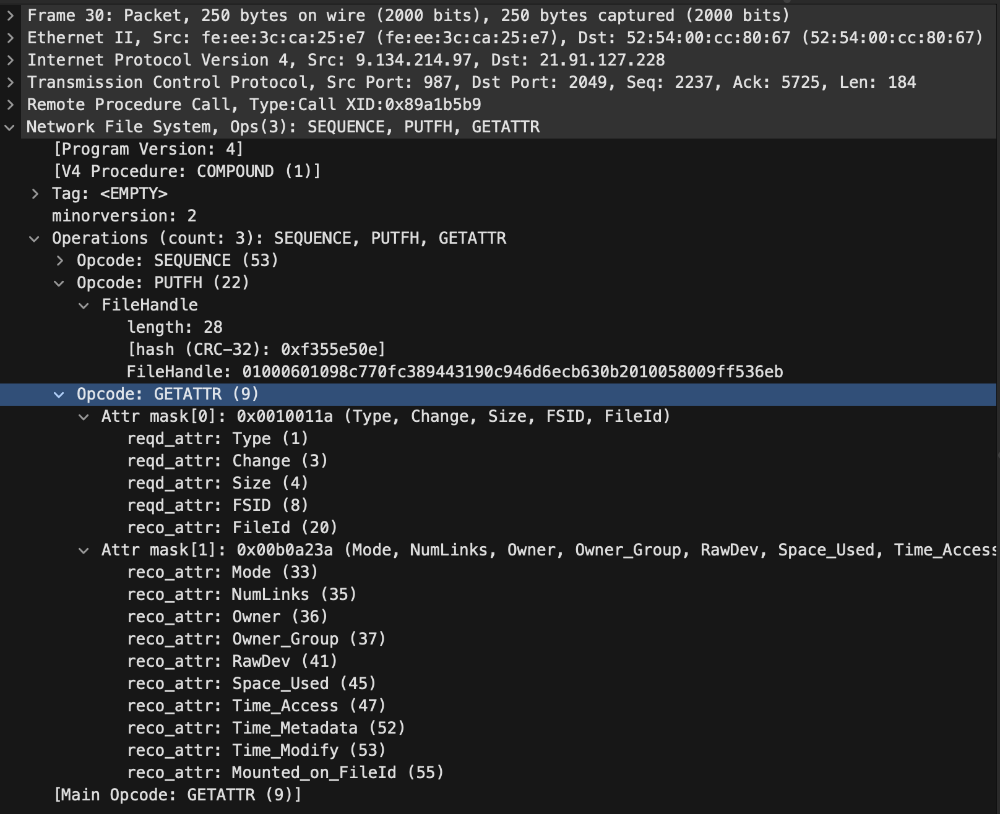

## NFS V3的性能影响：

从这两个指令的功能来看，因为当前服务器环境并没有支持文件相关拓展属性，所以 LISTXATTRS的交互是没有必要的，那么优化思路也就明确了：nfs v3更适合不支持 xattr 拓展属性环境的服务。我们使用 v3协议版本挂载一下当前目录做一下 ls -ld 的性能对比：

执行时间已经从9秒多降到了4.4.秒左右。查看一下当前的抓包交互过程：

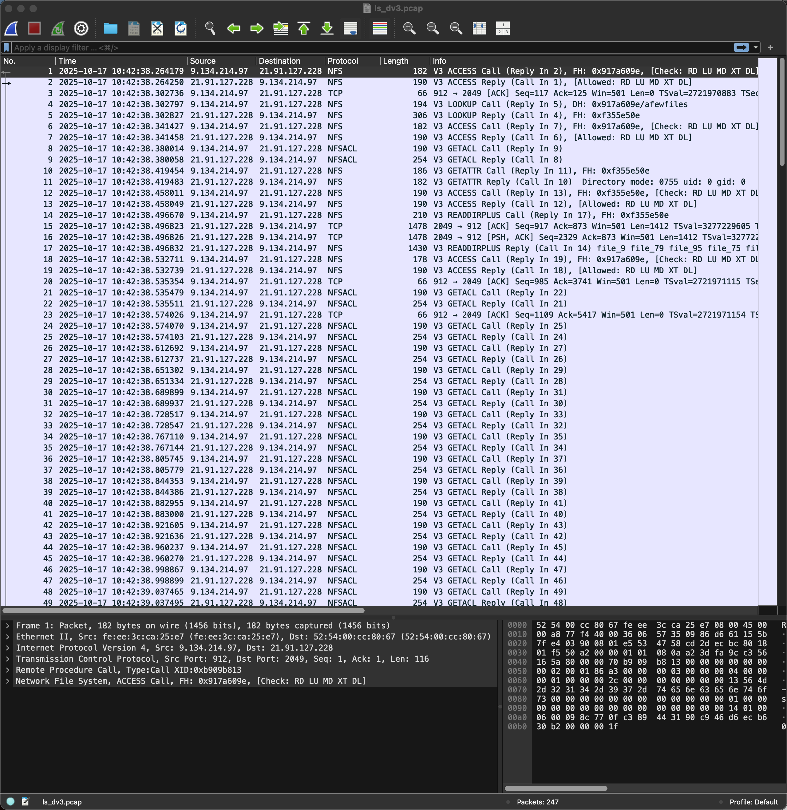

整个过程里已经没有了 LISTXATTRS 指令的交互。文件属性信息在 nfs v3中是通过 GETACL 指令进行交互的。整个交互过程中的指令传输少了一半，整体执行时间也下降一半。这就是为什么实际应用中，我们总是推荐使用 nfs v3的原因。在目录中文件较多的情况下，使用 nfs v3确实在很多应用场景下会大幅提升nfs文件遍历的性能。

## NFS V4的文件属性遍历性能优化：

但是 nfs v4为什么要多次交互文件属性信息呢？如果当前文件系统支持 xattr 属性，并且 ls -l 的时候需要显示拓展属性的话，因为 GETATTR 本身并未支持拓展属性的能力，所以是需要通过 LISTXATTRS 来对 xattr 属性进行查询的。

但是在未开启 xattr 的环境下，对每个文件都查询一遍就是一个明显的性能 bug 了。实际上 nfs 应该可以在 mount 的时候确认当前文件系统是否支持拓展属性，交互一次 LISTXATTRS 拿到结果，并根据结果决定后续遇到相关业务行为时，是否需要进一步查询文件的拓展属性会是一个更好的逻辑。我们在当前6.6.47-12.tl4.x86_64版本的内核中并未看到这个行为的逻辑。说明在比较旧版本的内核中，NFS V4及以上的实现都是有这个性能瓶颈缺陷的。

实际上这个缺陷在比较新的版本内核中已经进行了优化，主要的补丁有两个：

<https://git.kernel.org/pub/scm/linux/kernel/git/torvalds/linux.git/patch/fs/nfs?id=b01f21cacde9f2878492cf318fee61bf4ccad323>

<https://git.kernel.org/pub/scm/linux/kernel/git/torvalds/linux.git/patch/fs/nfs?id=b9defd611abf3d24354e14c8d85da14c7abaa07e>

其中对当前性能有最大影响的是第一个补丁，补丁的核心影响是：

将原 caps 的赋值从：

\- server-\>caps \|= server-\>nfs_client-\>cl_mvops-\>init_caps;

变成了：

\+ server-\>caps = server-\>nfs_client-\>cl_mvops-\>init_caps;

赋值不在从旧的值继承，而是从默认最小配置重新生成，默认最小配置如下数据结构所示，其中不含NFS_CAP_XATTR：

从而导致nfs4_listxattr_nfs4_user函数检查nfs_server_capable时直接返回。不再通过后续的nfs42_proc_listxattrs从server端拉一遍配置信息。从而减少了一个 rtt。

旧的值是在mount 的nfs_server_set_fsinfo 进行初始化，从 server 读到的是否支持xattr_support 选项，如果支持就设置NFS_CAP_XATTR

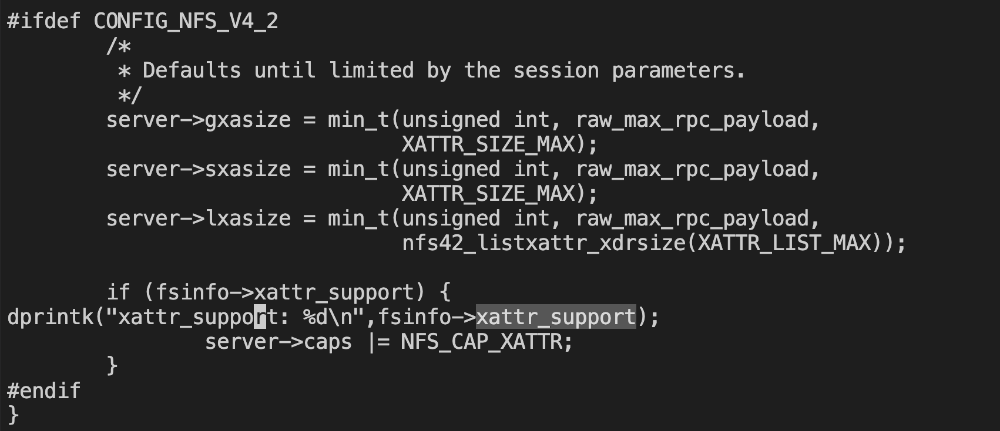

这两个补丁都是在6.16版本之后合入内核主线的，所以可以升级成6.16以上版本内核看看优化的效果。因为补丁比较简单，我们也可以在当前内核的基础上，打上这两个补丁来看看优化效果。注意，这个补丁主要影响的是 client 端的行为，所以只需要改变 client 端的内核版本就行：

打过补丁的内核已经从9秒提升到了跟 v3性能差不多的时间。我们再来看看网络包的交互情况：

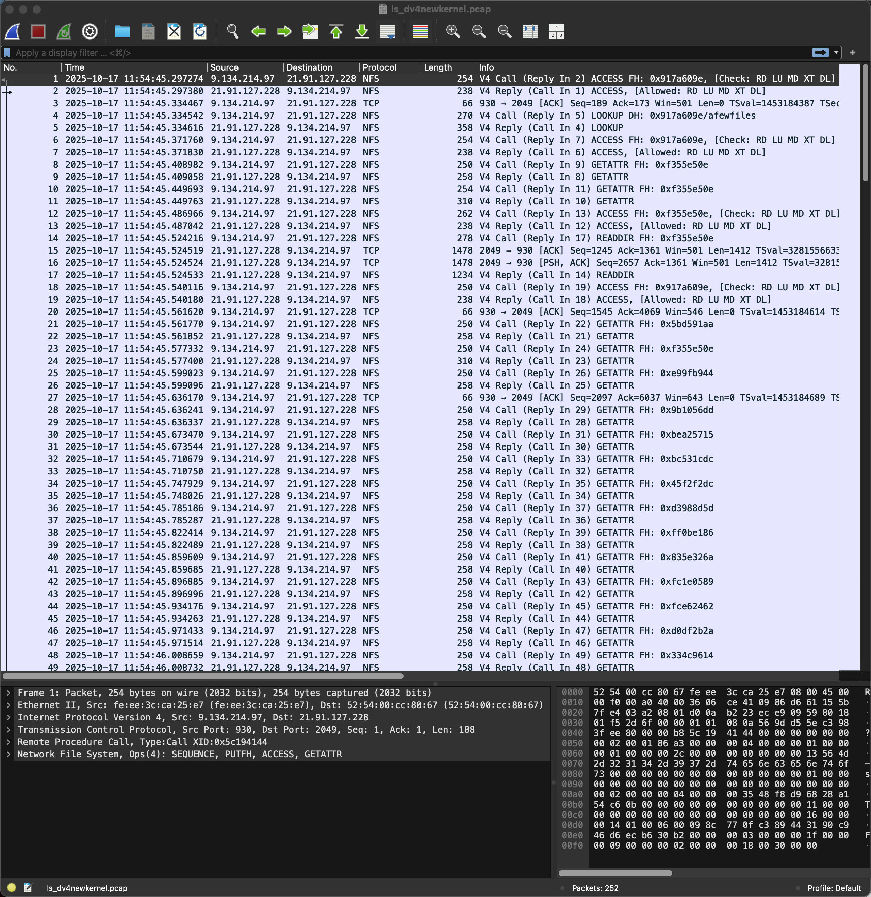

整个交互过程中已经没有了 LISTXATTRS 的交互。整体传输包的数量比 nfs v3还好少点。仅从当前这个应用场景来看，nfs v4在较新的内核版本上的性能，已经追平甚至优于 nfs v3的性能了。

## NFS cache 对文件属性性能的影响：

我们在上述测试中都有个默认动作，就是在执行 ls 之前先echo 3 \> /proc/sys/vm/drop_caches。这主要是为了防止 client 端的缓存影响我们测试的效果。那么这个缓存对性能有多大影响呢？可以来看一下：

重复几次测试我们就会发现，原本需要将近4秒的执行时间，在有缓存的情况下，只需要40ms 左右就可以执行完毕。这也可以理解，毕竟 nfs client 把文件 metadata 缓存在本地的内存中，相关查询就不用经过网络传输了。这可以大大提升目录遍历的性能。nfs也提供了针对文件属性缓存行为控制的一系列参数，可以供用户调整。主要包括：

以上帮助信息都可以通过 man 5 nfs 查询到，解释的也很清晰，这里就不做更多说明了。我们来看看如果挂载 nfs 的使用 noac 参数的话，在当前场景下会有多大性能损耗：

原来4秒左右的操作，变成了将近1分钟，这比之前遍历所有文件的时间要更长。这主要是因为当不在缓存任何文件的属性信息之后，每次访问一个路径的文件时，都要重复遍历其路径中的上层文件夹的权限是否有相应的权限，导致大量重复读取相关目录的属性信息。加上网络的延迟后，放大了整个遍历过程的延迟时间。从这个例子中，我们可以观察一下文件属性缓存对 nfs 文件遍历性能的影响有多大。

最后，是本文唯一能用 AI 生成的部分：

# 五、结束语（AI 生成）

本文以 “解剖三只麻雀” 的思路，围绕 NFS 存储在跨地域高延迟场景下的性能瓶颈展开，聚焦读性能、写性能、目录遍历性能三大核心应用场景，通过实测数据、抓包分析与内核层面拆解，明确了性能瓶颈的根源并提供了可落地的优化方案，核心技术要点可总结如下：

## 核心性能场景与优化要点回顾

### 1. NFS 读性能：突破协议与网络瓶颈

- 核心瓶颈：默认 NFS 4.2 协议因slot id上限（0-29）限制并发请求数，4k 随机读性能仅 127KiB/s、IOPS=31，远未达网络（1.55Gbits/s）与磁盘（IOPS=2466）上限。

- 关键优化：临时方案：切换至 NFS 3 协议，规避slot限制，配合nconnect多 TCP 连接（如 nconnect=4）突破单通道带宽瓶颈；

  - 根本方案：升级内核至 6.14+，内核补丁将NFSD_MAX_SLOTS_PER_SESSION提升至 2048，并支持动态扩容slot，同时增大 TCP 读写缓存（如 536870912 字节）解决 TCP 慢启动问题；

  - 最终效果：NFS 4.2 在 4k 随机读场景下带宽达 186MiB/s，逼近网络理论上限。

### 2. NFS 写性能：平衡并发与数据安全

- 核心瓶颈：随机写受 NFS 4.2 并发限制，顺序写因 NFS 多线程轮询导致 IO 无法合并，默认nfsd线程数（8 个）无法匹配磁盘并发能力。

- 关键优化：并发调优：调整nfsd线程数（如 32 个）匹配磁盘 IO 并发，突破随机写性能瓶颈；

  - 性能提升：开启async写缓存（server 端/etc/exports添加async），随机写带宽从 24.7MiB/s 提升至 187MiB/s，但需权衡 “性能提升” 与 “断电数据丢失风险”；

  - 版本适配：NFS 3 可临时规避 4.2 并发限制，NFS 4.2 需升级内核消除协议层瓶颈，最终写性能可追平 NFS 3。

### 3. NFS 目录遍历性能：消除冗余交互与缓存优化

- 核心瓶颈：NFS 4 默认发起LISTXATTRS（拓展属性查询）与GETATTR（基础属性查询）双交互，无 xattr 支持时冗余交互导致 ls -l 耗时达 9 秒（NFS 4），远高于 NFS 3 的 4.4 秒。

- 关键优化：版本选择：无 xattr 需求时，NFS 3 因无LISTXATTRS交互，目录遍历性能更优；

  - 内核修复：NFS 4 需升级内核（6.16+）或打补丁，通过重置server-\>caps默认值（不含NFS_CAP_XATTR）消除冗余LISTXATTRS交互，优化后 ls -l 耗时降至 4.2 秒，追平 NFS 3；

  - 缓存策略：合理配置文件属性缓存参数（ac默认开启，acregmin/acregmax控制文件缓存时间、acdirmin/acdirmax控制目录缓存时间），缓存命中时 ls -l 耗时可低至 40ms；禁用缓存（noac）虽保证一致性，但会导致耗时增至 55 秒，需谨慎使用。

## 优化逻辑与实践启示

整篇文章的优化逻辑围绕 “定位瓶颈层→针对性突破→权衡风险与收益” 展开：

1.  瓶颈分层：性能问题需区分 “协议层”（如 NFS 4.2 slot 限制）、“网络层”（TCP 慢启动）、“硬件层”（磁盘并发、网络带宽）、“缓存层”（文件属性缓存），避免盲目调参；

2.  版本权衡：NFS 3 适合对性能敏感、无 xattr / 安全需求的场景，NFS 4.2（升级内核后）则在安全性（加密、Kerberos）、易用性（单一端口）、功能扩展性（克隆、Reflink）上更优，需根据业务需求选择；

3.  风险可控：async写缓存、noac缓存策略等优化需明确 “性能提升” 与 “数据安全 / 一致性” 的 trade-off，避免因追求性能忽视业务风险。

本文通过实测验证了各优化方案的有效性，尤其针对跨地域高延迟（40ms）、大规模数据访问场景，提供了从 “参数调优” 到 “内核升级” 的全链路解决方案。希望能为 NFS 存储的运维、开发人员提供参考，助力在实际业务中平衡 NFS 的性能与稳定性。
